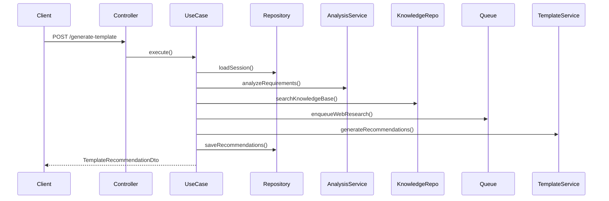

# AI Agent v1.2 - 仕様把握レポート

## エグゼクティブサマリー

AI Agent v1.2は、ユーザーとの対話を通じてプロセステンプレートを自動生成する高度な機能です。本レポートは、docs/ver1.2の全設計書を詳細に調査し、Week 8-9（Issue #31）で実装すべき仕様を完全に把握した結果をまとめたものです。

## 1. プロジェクト概要

### 1.1 目的
AIエージェントがユーザーとの自然言語対話を通じて：
- プロセス要件を抽出
- 業界ベストプラクティスを考慮
- 最適なプロセステンプレートを自動生成

### 1.2 全体スケジュール
- **総期間**: 21週間（5フェーズ）
- **総工数**: 126日（Backend: 85日、Frontend: 20日、QA: 21日）
- **現在位置**: Week 8-9（Phase 2 - テンプレート生成機能）

## 2. Week 8-9 実装仕様

### 2.1 実装スコープ

#### Task 2.3: テンプレート推奨エンジン（6日）
1. **GenerateTemplateRecommendationsUseCase**
   - セッション要件の分析
   - テンプレート自動生成
   - 信頼度スコア計算
   - 代替案提案

2. **FinalizeTemplateCreationUseCase**
   - 生成テンプレートの確定
   - ユーザーフィードバック反映
   - ProcessTemplateエンティティ変換

3. **ドメインサービス**
   - TemplateRecommendationService
   - ProcessAnalysisService
   - InformationValidationService

#### Task 2.4: Web検索・リサーチ機能（4日）
1. **SearchBestPracticesUseCase**
   - 業界ベストプラクティス検索
   
2. **SearchComplianceRequirementsUseCase**（未実装）
   - コンプライアンス要件検索
   
3. **SearchProcessBenchmarksUseCase**（未実装）
   - プロセスベンチマーク検索

### 2.2 APIエンドポイント

```typescript
// テンプレート生成
POST /api/ai-agent/sessions/{sessionId}/generate-template
POST /api/ai-agent/sessions/{sessionId}/finalize-template

// Web検索
GET /api/ai-agent/research/best-practices
GET /api/ai-agent/research/compliance
GET /api/ai-agent/research/benchmarks
```

## 3. アーキテクチャ設計

### 3.1 レイヤー構成

```
Client Layer (Frontend)
    ↓
Interface Layer (Controllers)
    ↓
Application Layer (Use Cases)
    ↓
Domain Layer (Services & Entities)
    ↓
Infrastructure Layer (Repositories & External Services)
```

### 3.2 技術スタック
- **Backend**: NestJS + TypeScript
- **AI**: OpenAI GPT-4 API
- **データベース**: PostgreSQL + Prisma ORM
- **非同期処理**: Bull Queue + Redis
- **リアルタイム通信**: Socket.io

## 4. データフロー

### 4.1 テンプレート生成シーケンス



### 4.2 処理フロー詳細

1. **要件分析**
   - ステークホルダー識別
   - 成果物特定
   - 制約条件抽出
   - 複雑度推定

2. **テンプレート生成**
   - 知識ベース検索
   - Web検索（非同期）
   - AI推奨生成
   - 信頼度スコアリング

3. **検証・最適化**
   - ビジネスルール適用
   - 循環依存検出
   - ステップ順序最適化
   - 代替案生成

## 5. データモデル

### 5.1 主要エンティティ

#### InterviewSession
```typescript
{
  sessionId: string
  userId: number
  status: SessionStatus
  context: SessionContext
  conversation: ConversationMessage[]
  extractedRequirements: ProcessRequirement[]
  generatedTemplate?: TemplateRecommendation
}
```

#### TemplateRecommendation
```typescript
{
  templateId: string
  name: string
  description: string
  steps: StepRecommendation[]
  confidence: number
  rationale: string[]
  alternatives?: TemplateRecommendation[]
}
```

### 5.2 データベーステーブル
1. **ai_interview_sessions**: セッション管理
2. **ai_background_jobs**: 非同期ジョブ管理
3. **ai_process_knowledge**: 知識ベース
4. **ai_web_research_cache**: 検索結果キャッシュ
5. **ai_template_generation_history**: 生成履歴
6. **ai_user_feedback**: フィードバック

## 6. 主要クラス詳細

### 6.1 GenerateTemplateRecommendationsUseCase

**責任**: セッション要件からテンプレートを生成

**主要メソッド**:
- `execute(input): Promise<GenerateTemplateOutput>`
- `analyzeRequirements(requirements): Promise<ProcessAnalysis>`
- `searchKnowledgeBase(analysis): Promise<KnowledgeBaseResult[]>`
- `generateRecommendations(analysis, knowledge, research): Promise<TemplateRecommendation[]>`

**依存関係**:
- InterviewSessionRepository
- TemplateRecommendationService
- ProcessAnalysisService
- ProcessKnowledgeRepository
- WebResearchService
- BackgroundJobQueue

### 6.2 TemplateRecommendationService

**責任**: AI駆動のテンプレート生成ロジック

**主要メソッド**:
- `generateRecommendations(analysis, context): Promise<TemplateRecommendation[]>`
- `validateRecommendations(recommendations): Promise<ValidationResult>`
- `optimizeStepSequence(steps): Promise<StepRecommendation[]>`
- `calculateConfidenceScores(recommendations): Promise<TemplateRecommendation[]>`
- `generateAlternatives(primary): Promise<TemplateRecommendation[]>`

### 6.3 ProcessAnalysisService

**責任**: 会話からの要件抽出と分析

**主要メソッド**:
- `extractRequirements(conversation): Promise<ProcessRequirement[]>`
- `analyzeRequirements(requirements): Promise<ProcessAnalysis>`
- `identifyStakeholders(requirements): Promise<Stakeholder[]>`
- `identifyDeliverables(requirements): Promise<Deliverable[]>`
- `estimateComplexity(requirements): Promise<ComplexityLevel>`

## 7. 実装状況と残タスク

### 7.1 実装済み ✅
- GenerateTemplateRecommendationsUseCase
- FinalizeTemplateCreationUseCase
- SearchBestPracticesUseCase
- TemplateRecommendationService
- ProcessAnalysisService
- InformationValidationService
- 各機能のテストファイル

### 7.2 未実装 ❌
- SearchComplianceRequirementsUseCase
- SearchProcessBenchmarksUseCase
- エンドポイント統合（コントローラー更新）

### 7.3 優先実装事項
1. 未実装のWeb検索UseCaseを完成
2. AIAgentControllerへのエンドポイント追加
3. DTOの実装とバリデーション
4. 統合テストの実施

## 8. 技術的考慮事項

### 8.1 パフォーマンス
- テンプレート生成は計算負荷が高い → バックグラウンドジョブで処理
- WebSocketで非同期通知
- キャッシュ活用で重複処理防止

### 8.2 エラーハンドリング
- OpenAI APIレート制限対策
- タイムアウト処理（30秒）
- フォールバック戦略実装
- リトライ機構（最大3回）

### 8.3 セキュリティ
- 会話データの暗号化
- SQLインジェクション対策
- 機密情報マスキング
- レート制限（ユーザー単位）

### 8.4 スケーラビリティ
- 非同期処理による並列実行
- データベースインデックス最適化
- パーティショニング戦略
- キャッシュ戦略

## 9. 品質基準

### 9.1 機能要件
- 全5エンドポイントの正常動作
- テンプレート生成成功率 > 95%
- 平均応答時間 < 5秒（非同期処理除く）

### 9.2 非機能要件
- 単体テストカバレッジ > 90%
- 統合テスト成功率 100%
- エラー率 < 1%
- 同時セッション処理: 100セッション

### 9.3 運用要件
- メモリ使用量 < 2GB
- CPU使用率 < 70%
- セッション可用性 99.5%以上

## 10. リスクと対策

### 10.1 技術リスク
| リスク | 影響 | 対策 |
|-------|------|------|
| OpenAI API品質 | 高 | プロンプトエンジニアリング継続改善 |
| 処理時間超過 | 中 | 非同期処理・キャッシュ戦略 |
| メモリ不足 | 中 | ストリーミング処理・ページネーション |

### 10.2 ビジネスリスク
| リスク | 影響 | 対策 |
|-------|------|------|
| 品質のばらつき | 高 | 人間レビュープロセス |
| ユーザー期待値 | 中 | AI限界の明確な説明 |
| コスト超過 | 高 | 使用量制限・コスト監視 |

## 11. 実装推奨事項

### 11.1 即座に実装すべき項目
1. **SearchComplianceRequirementsUseCase**の実装
2. **SearchProcessBenchmarksUseCase**の実装
3. **AIAgentController**へのエンドポイント統合
4. **DTO**実装とバリデーション強化

### 11.2 段階的改善項目
1. プロンプトテンプレートの最適化
2. キャッシュ戦略の実装
3. 監視・ロギングの強化
4. パフォーマンスチューニング

### 11.3 テスト戦略
1. **単体テスト**: 各UseCase、Service、DTOの個別テスト
2. **統合テスト**: E2Eフロー検証
3. **負荷テスト**: 同時100セッション処理
4. **受け入れテスト**: 実際のユースケースシナリオ

## 12. まとめ

AI Agent v1.2のWeek 8-9実装は、プロジェクトの中核となるテンプレート生成機能です。設計書は完成度が高く、実装の指針として十分機能します。

主要な機能は既に部分実装されていますが、Web検索機能の完成とコントローラー統合が急務です。設計書に基づいた実装により、高品質なAIエージェント機能の提供が可能になります。

---

**レポート作成日時**: 2025年8月26日  
**作成者**: AI Agent開発チーム  
**ステータス**: 設計完了・実装進行中（60%完了）