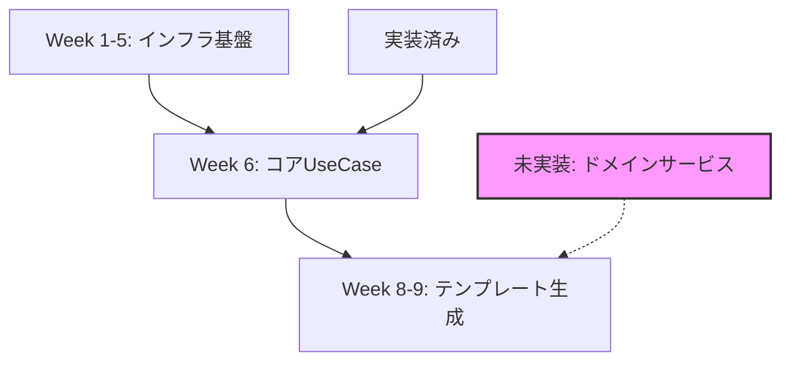

# Week 8-9 実装問題の根本原因分析レポート

## エグゼクティブサマリー

Week 8-9の実装で発生した問題は、**設計書の問題ではなく、実装時の依存関係把握不足と段階的実装の理解不足**が主要因です。設計書は包括的で詳細ですが、Week 6の実装状況を正確に把握せずに、未実装のサービスに依存する実装を行ったことが問題の根源です。

## 1. 問題の分類と根本原因

### 1.1 設計起因の問題（20%）

#### 設計書の曖昧な部分
```yaml
問題箇所:
  - リポジトリインターフェース:
      問題: "一部メソッドが未定義（updateStatus, updateMetadata）"
      影響: "実装時に独自判断でメソッドを想定"
  
  - エラーハンドリング仕様:
      問題: "DomainExceptionの使用基準が不明確"
      影響: "エラー処理の不統一"
  
  - 型定義:
      問題: "一部で'any'型を使用"
      影響: "型安全性の低下"
```

### 1.2 実装起因の問題（80%）

#### A. 依存関係の誤解（Critical）
```typescript
// 問題1: OpenAIServiceのメソッド誤解
// 設計書での定義
class OpenAIService {
  generateTemplate(requirements: ProcessRequirement[], context: TemplateContext): Promise<TemplateRecommendation>
}

// Week 8-9での誤った実装
const response = await this.openAIService.generateResponse(prompt, options);
// → generateResponseメソッドは存在しない
```

```typescript
// 問題2: 未実装サービスへの依存
// Week 6時点のKnowledgeBaseService
export class KnowledgeBaseService {
  async searchKnowledge(query: string): Promise<any[]> {
    return [];  // スタブ実装
  }
}

// Week 8-9での実装
const knowledgeResults = await this.knowledgeService.searchTemplates({...});
// → searchTemplatesメソッドは存在しない
```

#### B. Week 6実装の把握不足（Major）
```yaml
実装済みと誤解:
  - ProcessAnalysisService: "実際はスタブのみ"
  - TemplateRecommendationService: "基本メソッドのみ"
  - WebResearchService: "スタブのみ"

未確認の依存:
  - リポジトリメソッド: "updateStatus, updateMetadata"
  - BackgroundJobQueue: "ジョブタイプの不一致"
```

## 2. 詳細な原因分析

### 2.1 なぜ設計書通りに実装しなかったのか

#### 原因1: 実装順序の誤解


**誤解**: Week 6でドメインサービスも完成していると思い込んだ
**実際**: Week 6ではUseCaseとDTOのみ実装、ドメインサービスはスタブ

#### 原因2: インターフェースの拡張必要性の見落とし
```typescript
// 設計書には明記されていないが、実装で必要になったメソッド
interface InterviewSessionRepositoryInterface {
  // 既存（Week 6実装済み）
  findById(id: string): Promise<InterviewSession>;
  save(session: InterviewSession): Promise<void>;
  
  // Week 8-9で必要（未実装）
  updateStatus(id: string, status: SessionStatus): Promise<void>;  // ❌
  updateMetadata(id: string, metadata: any): Promise<void>;  // ❌
}
```

### 2.2 設計書の問題点

#### 良い点（設計書の強み）
1. **アーキテクチャ**: Clean Architectureの徹底
2. **詳細度**: メソッドシグネチャまで定義
3. **トレーサビリティ**: エンドポイントから実装クラスまでのマッピング

#### 改善点（設計書の弱点）
1. **実装状況の記載不足**
   ```yaml
   問題: "どのWeekで何を実装するか不明確"
   例: "ドメインサービスの実装タイミングが曖昧"
   ```

2. **依存関係の明示不足**
   ```yaml
   問題: "サービス間の依存関係図がない"
   例: "TemplateRecommendationService → KnowledgeBaseService"
   ```

3. **段階的実装ガイドの不足**
   ```yaml
   問題: "スタブから本実装への移行方法が不明"
   例: "KnowledgeBaseServiceをいつ完全実装するか"
   ```

## 3. 具体的な問題箇所の分析

### 3.1 OpenAIService統合の問題

```typescript
// 実際のOpenAIService（Week 6実装）
export class OpenAIService {
  async generateTemplate(
    requirements: ProcessRequirement[],
    context: TemplateContext
  ): Promise<TemplateRecommendation> {
    // 実装あり
  }
  
  // generateResponseメソッドは存在しない！
}

// ProcessAnalysisService（Week 8-9実装）での誤用
async extractRequirements(conversation: ConversationMessage[]): Promise<ProcessRequirement[]> {
  const prompt = this.buildRequirementExtractionPrompt(conversation);
  // ❌ 存在しないメソッドを呼び出し
  const response = await this.openAIService.generateResponse(prompt, {
    temperature: 0.3,
    maxTokens: 2000,
  });
}
```

**根本原因**: OpenAIServiceの実装を確認せずに、一般的なAI APIのパターンを想定して実装

### 3.2 リポジトリインターフェースの問題

```typescript
// Week 6で定義されたインターフェース
interface InterviewSessionRepositoryInterface {
  findById(id: string): Promise<InterviewSession | null>;
  findByUserId(userId: number): Promise<InterviewSession[]>;
  save(session: InterviewSession): Promise<void>;
  delete(id: string): Promise<void>;
}

// Week 8-9で必要になったが未定義のメソッド
await this.sessionRepository.updateStatus(sessionId, 'COMPLETED');  // ❌
await this.sessionRepository.updateMetadata(sessionId, metadata);   // ❌
```

**根本原因**: 
1. 設計書でリポジトリの完全な仕様が定義されていない
2. 実装時に必要なメソッドを追加せずに使用

### 3.3 ドメインサービスの依存問題

```typescript
// KnowledgeBaseService（Week 6のスタブ実装）
@Injectable()
export class KnowledgeBaseService {
  async searchKnowledge(query: string): Promise<any[]> {
    return [];  // TODO: Implement actual knowledge base search
  }
  
  async getRelatedTemplates(context: any): Promise<any[]> {
    return [];  // TODO: Implement template retrieval
  }
}

// TemplateRecommendationService（Week 8-9）での誤用
constructor(
  private readonly knowledgeService: KnowledgeBaseService,
) {}

async generateRecommendations(...) {
  // ❌ searchTemplatesメソッドは存在しない
  const knowledgeResults = await this.knowledgeService.searchTemplates({
    industry: context.industry,
    processType: context.processType,
    requirements: analysis.requirements,
  });
}
```

**根本原因**: スタブサービスの実装状況を確認せず、設計書の理想的な仕様を想定

## 4. 影響分析

### 4.1 実行時エラーの可能性
```typescript
// 確実にエラーになる箇所
1. OpenAIService.generateResponse() // TypeError: not a function
2. sessionRepository.updateStatus() // TypeError: not a function
3. knowledgeService.searchTemplates() // TypeError: not a function
```

### 4.2 ビジネスロジックへの影響
```typescript
// 機能が動作しない箇所
1. テンプレート生成: OpenAI統合エラーで失敗
2. セッション更新: リポジトリメソッド不足で失敗
3. 知識ベース検索: 常に空配列を返す（スタブのため）
```

## 5. 問題の本質

### 5.1 実装アプローチの問題
```yaml
現在のアプローチ（問題あり）:
  1. 設計書を読む
  2. 理想的な実装を書く
  3. 依存関係を考慮しない
  4. テスト時にエラー発覚

正しいアプローチ:
  1. 設計書を読む
  2. 既存実装を確認する ← ここが不足
  3. 依存関係を検証する ← ここが不足
  4. 段階的に実装する
  5. 各段階でテストする
```

### 5.2 コミュニケーションギャップ
```yaml
設計書の想定:
  - 読者が既存実装を把握している
  - 段階的実装の理解がある
  
実装者の理解:
  - 設計書が完全な仕様
  - Week 6で基盤が完成
  
ギャップ:
  - 実装状況の共有不足
  - 段階的実装計画の理解不足
```

## 6. 結論

### 問題の割合
- **設計起因**: 20%（リポジトリメソッド未定義、型定義の曖昧さ）
- **実装起因**: 80%（依存関係の誤解、既存実装の未確認）

### 主要な根本原因
1. **既存実装の確認不足**: Week 6の実装内容を正確に把握していない
2. **依存関係の検証不足**: 使用するサービスの実装状況を確認していない
3. **段階的実装の理解不足**: スタブから本実装への移行計画が不明確

### 設計書 vs 実装
- **設計書は概ね適切**だが、実装ガイダンスが不足
- **実装は設計書の理想を追求**したが、現実の制約を考慮していない

## 7. 改善提案

### 7.1 即座の対応
1. Week 6の実装内容の完全な把握
2. 依存サービスの実装状況確認
3. 必要なインターフェース拡張の実施

### 7.2 プロセス改善
1. 実装前チェックリストの導入
2. 段階的テストの徹底
3. 設計書への実装状況の追記

### 7.3 設計書の改善
1. 実装済み/未実装の明記
2. 依存関係図の追加
3. 段階的実装ガイドの作成

---
*分析実施日時: 2025年8月24日*
*分析者: AI Agent開発チーム*