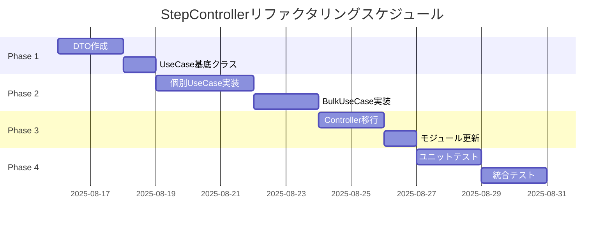

# StepController Clean Architectureリファクタリング計画書

作成日: 2025-08-15  
作成者: Claude Code  
対象: Process Todo API - StepController

## 目次

1. [エグゼクティブサマリー](#1-エグゼクティブサマリー)
2. [現状分析](#2-現状分析)
3. [目標アーキテクチャ](#3-目標アーキテクチャ)
4. [リファクタリング設計](#4-リファクタリング設計)
5. [段階的移行計画](#5-段階的移行計画)
6. [実装詳細](#6-実装詳細)
7. [リスク管理](#7-リスク管理)
8. [成功指標](#8-成功指標)

## 1. エグゼクティブサマリー

### 1.1 目的

StepControllerをClean Architectureに準拠させ、プロジェクト全体のアーキテクチャ一貫性を確保する。

### 1.2 主要な変更点

- **UseCaseレイヤーの導入**: ビジネスロジックをControllerから分離
- **適切な依存性注入**: インターフェースベースのDI実装
- **標準的なエラーハンドリング**: NestJS標準例外クラスの使用
- **WebSocket統合の改善**: イベント駆動アーキテクチャの採用

### 1.3 期待される効果

| 効果 | 現在 | リファクタリング後 |
|------|------|-------------------|
| テスタビリティ | 低 | 高 |
| 保守性 | 低 | 高 |
| 拡張性 | 低 | 高 |
| コード重複 | 多い | 最小限 |
| アーキテクチャ一貫性 | なし | 完全準拠 |

## 2. 現状分析

### 2.1 現在のアーキテクチャ問題

#### アーキテクチャ違反箇所

```typescript
// 現在の問題のあるコード (step.controller.ts)
@Controller('steps')
export class StepController {
  constructor(
    @Inject('IStepInstanceRepository')
    private readonly stepInstanceRepository: IStepInstanceRepository,  // ❌ 直接リポジトリ注入
    @Inject('IUserRepository')
    private readonly userRepository: IUserRepository,  // ❌ 直接リポジトリ注入
    private readonly realtimeGateway: RealtimeGateway,
  ) {}

  async updateStatus(@Param('id') id: string, @Body() dto: UpdateStepStatusDto) {
    const stepId = parseInt(id, 10);
    const step = await this.stepInstanceRepository.findById(stepId);  // ❌ 直接リポジトリアクセス
    
    if (!step) {
      throw new Error('Step not found');  // ❌ 不適切なエラーハンドリング
    }
    
    // ビジネスロジックがControllerに存在  // ❌
    step.updateStatus(new StepStatus(dto.status));
    const updatedStep = await this.stepInstanceRepository.update(step);
    
    return this.toResponseDto(updatedStep);  // ❌ 変換ロジックの重複
  }
}
```

### 2.2 他のControllerとの比較

#### 良い実装例 (case.controller.ts)

```typescript
@Controller('cases')
export class CaseController {
  constructor(
    private readonly createCaseUseCase: CreateCaseUseCase,  // ✅ UseCase注入
    private readonly getCasesUseCase: GetCasesUseCase,     // ✅ UseCase注入
  ) {}

  @Post()
  async create(@Body() dto: CreateCaseDto): Promise<CaseResponseDto> {
    return this.createCaseUseCase.execute(dto);  // ✅ UseCaseに委譲
  }
}
```

### 2.3 影響範囲分析

| コンポーネント | 影響度 | 詳細 |
|---------------|--------|------|
| StepController | 高 | 全メソッドの書き換えが必要 |
| StepModule | 中 | プロバイダー設定の変更 |
| 統合テスト | 高 | モック対象の変更が必要 |
| フロントエンド | なし | API互換性を維持 |
| WebSocket | 低 | 通知タイミングの改善のみ |

## 3. 目標アーキテクチャ

### 3.1 レイヤー構造

```
┌─────────────────────────────────────────────────┐
│             Presentation Layer                   │
│         (Controllers, WebSocket Gateway)         │
├─────────────────────────────────────────────────┤
│             Application Layer                    │
│      (Use Cases, DTOs, Application Services)     │
├─────────────────────────────────────────────────┤
│               Domain Layer                       │
│    (Entities, Value Objects, Domain Services)    │
├─────────────────────────────────────────────────┤
│            Infrastructure Layer                  │
│      (Repositories, External Services)           │
└─────────────────────────────────────────────────┘
```

### 3.2 依存関係の方向

```
Controller → UseCase → Repository Interface
                ↓
          Domain Entity
```

## 4. リファクタリング設計

### 4.1 必要なUseCaseクラス

| UseCase | 責任 | 入力DTO | 出力DTO |
|---------|------|---------|---------|
| GetStepByIdUseCase | ステップ詳細取得 | GetStepDto | StepResponseDto |
| UpdateStepStatusUseCase | ステータス更新 | UpdateStepStatusDto | StepResponseDto |
| AssignStepToUserUseCase | 担当者割当 | AssignStepDto | StepResponseDto |
| LockStepUseCase | ステップロック | LockStepDto | StepResponseDto |
| UnlockStepUseCase | ステップアンロック | UnlockStepDto | StepResponseDto |
| BulkUpdateStepsUseCase | 一括更新 | BulkUpdateStepsDto | StepResponseDto[] |

### 4.2 DTOの設計

#### 入力DTO構造

```typescript
// src/application/dto/step/update-step-status.dto.ts
export class UpdateStepStatusDto {
  @IsEnum(StepStatusEnum)
  @ApiProperty({ enum: StepStatusEnum })
  status: StepStatusEnum;
}

// src/application/dto/step/assign-step.dto.ts
export class AssignStepDto {
  @IsOptional()
  @IsInt()
  @Min(1)
  @ApiProperty({ required: false })
  assigneeId?: number | null;
}
```

#### 出力DTO構造

```typescript
// src/application/dto/step/step-response.dto.ts
export class StepResponseDto {
  id: number;
  caseId: number;
  templateId: number;
  name: string;
  startDateUtc: Date | null;
  dueDateUtc: Date | null;
  assigneeId: number | null;
  assigneeName?: string;
  status: string;
  locked: boolean;
  createdAt: Date;
  updatedAt: Date;
  isOverdue: boolean;
  daysUntilDue: number | null;
}
```

### 4.3 エラーハンドリング戦略

| エラーケース | 使用する例外クラス | HTTPステータス |
|-------------|------------------|---------------|
| ステップが見つからない | NotFoundException | 404 |
| 無効なステータス遷移 | BadRequestException | 400 |
| ロック済みステップの変更 | ForbiddenException | 403 |
| 権限不足 | UnauthorizedException | 401 |
| 同時更新の競合 | ConflictException | 409 |

### 4.4 WebSocket統合設計

#### イベント駆動アーキテクチャ

```typescript
// UseCase内でのイベント発行
@Injectable()
export class UpdateStepStatusUseCase {
  constructor(
    @Inject('IStepInstanceRepository')
    private readonly stepRepository: IStepInstanceRepository,
    private readonly eventEmitter: EventEmitter2,
  ) {}

  async execute(dto: UpdateStepStatusDto): Promise<StepResponseDto> {
    // ビジネスロジック実行
    const step = await this.updateStep(dto);
    
    // イベント発行
    this.eventEmitter.emit('step.status.updated', {
      caseId: step.getCaseId(),
      stepId: step.getId(),
      oldStatus: dto.oldStatus,
      newStatus: dto.status,
      updatedBy: dto.userId,
    });
    
    return this.toResponseDto(step);
  }
}
```

## 5. 段階的移行計画

### 5.1 タイムライン



### 5.2 各フェーズの詳細

#### Phase 1: 基盤準備（2日）

**作業内容**:
1. DTOクラスの作成
   - 入力DTOのバリデーション実装
   - 出力DTOのシリアライズ設定
   - Swagger定義の追加

2. UseCase基底クラスの検討
   - 共通エラーハンドリング
   - ログ記録
   - トランザクション管理

#### Phase 2: UseCaseクラス実装（5日）

**作業内容**:
1. 個別UseCase実装（3日）
   - GetStepByIdUseCase
   - UpdateStepStatusUseCase
   - AssignStepToUserUseCase
   - LockStepUseCase
   - UnlockStepUseCase

2. BulkUpdateStepsUseCase実装（2日）
   - バッチ処理の最適化
   - トランザクション制御
   - 部分的失敗のハンドリング

#### Phase 3: Controller移行（3日）

**作業内容**:
1. 新Controller実装（2日）
   - 既存メソッドをUseCaseベースに書き換え
   - エラーハンドリングの統一
   - ログ出力の改善

2. モジュール更新（1日）
   - プロバイダー設定の更新
   - 依存関係の整理
   - エクスポートの設定

#### Phase 4: テスト・統合（4日）

**作業内容**:
1. ユニットテスト実装（2日）
   - UseCase単体テスト
   - Controllerテスト（モック使用）
   - カバレッジ80%以上

2. 統合テスト（2日）
   - E2Eテスト
   - WebSocket統合テスト
   - パフォーマンステスト

## 6. 実装詳細

### 6.1 GetStepByIdUseCase実装例

```typescript
// src/application/usecases/step/get-step-by-id.usecase.ts
import { Injectable, Inject, NotFoundException } from '@nestjs/common';
import { IStepInstanceRepository } from '@domain/repositories/step-instance.repository.interface';
import { StepResponseDto } from '@application/dto/step/step-response.dto';
import { GetStepDto } from '@application/dto/step/get-step.dto';

@Injectable()
export class GetStepByIdUseCase {
  constructor(
    @Inject('IStepInstanceRepository')
    private readonly stepRepository: IStepInstanceRepository,
    @Inject('IUserRepository')
    private readonly userRepository: IUserRepository,
  ) {}

  async execute(dto: GetStepDto): Promise<StepResponseDto> {
    const step = await this.stepRepository.findById(dto.stepId);
    
    if (!step) {
      throw new NotFoundException(`Step with ID ${dto.stepId} not found`);
    }

    // 担当者名を取得（オプション）
    let assigneeName: string | undefined;
    if (step.getAssigneeId()) {
      const user = await this.userRepository.findById(step.getAssigneeId()!);
      assigneeName = user?.getName();
    }

    return this.toResponseDto(step, assigneeName);
  }

  private toResponseDto(step: StepInstance, assigneeName?: string): StepResponseDto {
    return {
      id: step.getId()!,
      caseId: step.getCaseId(),
      templateId: step.getTemplateId(),
      name: step.getName(),
      startDateUtc: step.getStartDate()?.getDate() || null,
      dueDateUtc: step.getDueDate()?.getDate() || null,
      assigneeId: step.getAssigneeId(),
      assigneeName,
      status: step.getStatus().toString(),
      locked: step.isLocked(),
      createdAt: step.getCreatedAt(),
      updatedAt: step.getUpdatedAt(),
      isOverdue: step.isOverdue(),
      daysUntilDue: step.getDaysUntilDue(),
    };
  }
}
```

### 6.2 リファクタリング後のStepController

```typescript
// src/interfaces/controllers/step/step.controller.ts
import { Controller, Get, Put, Post, Patch, Param, Body, ParseIntPipe } from '@nestjs/common';
import { ApiTags, ApiOperation, ApiResponse } from '@nestjs/swagger';
import { GetStepByIdUseCase } from '@application/usecases/step/get-step-by-id.usecase';
import { UpdateStepStatusUseCase } from '@application/usecases/step/update-step-status.usecase';
import { AssignStepToUserUseCase } from '@application/usecases/step/assign-step-to-user.usecase';
import { LockStepUseCase } from '@application/usecases/step/lock-step.usecase';
import { UnlockStepUseCase } from '@application/usecases/step/unlock-step.usecase';
import { BulkUpdateStepsUseCase } from '@application/usecases/step/bulk-update-steps.usecase';
import { StepResponseDto } from '@application/dto/step/step-response.dto';
import { UpdateStepStatusDto } from '@application/dto/step/update-step-status.dto';
import { AssignStepDto } from '@application/dto/step/assign-step.dto';
import { BulkUpdateStepsDto } from '@application/dto/step/bulk-update-steps.dto';

@ApiTags('Steps')
@Controller('steps')
export class StepController {
  constructor(
    private readonly getStepByIdUseCase: GetStepByIdUseCase,
    private readonly updateStepStatusUseCase: UpdateStepStatusUseCase,
    private readonly assignStepToUserUseCase: AssignStepToUserUseCase,
    private readonly lockStepUseCase: LockStepUseCase,
    private readonly unlockStepUseCase: UnlockStepUseCase,
    private readonly bulkUpdateStepsUseCase: BulkUpdateStepsUseCase,
  ) {}

  @Get(':id')
  @ApiOperation({ summary: 'Get step by ID' })
  @ApiResponse({ status: 200, description: 'Step found', type: StepResponseDto })
  @ApiResponse({ status: 404, description: 'Step not found' })
  async findOne(@Param('id', ParseIntPipe) id: number): Promise<StepResponseDto> {
    return this.getStepByIdUseCase.execute({ stepId: id });
  }

  @Put(':id/status')
  @ApiOperation({ summary: 'Update step status' })
  @ApiResponse({ status: 200, description: 'Status updated', type: StepResponseDto })
  @ApiResponse({ status: 400, description: 'Invalid status transition' })
  @ApiResponse({ status: 404, description: 'Step not found' })
  async updateStatus(
    @Param('id', ParseIntPipe) id: number,
    @Body() dto: UpdateStepStatusDto,
  ): Promise<StepResponseDto> {
    return this.updateStepStatusUseCase.execute({ stepId: id, ...dto });
  }

  @Put(':id/assignee')
  @ApiOperation({ summary: 'Assign or unassign user to step' })
  @ApiResponse({ status: 200, description: 'Assignee updated', type: StepResponseDto })
  @ApiResponse({ status: 404, description: 'Step or user not found' })
  async assignTo(
    @Param('id', ParseIntPipe) id: number,
    @Body() dto: AssignStepDto,
  ): Promise<StepResponseDto> {
    return this.assignStepToUserUseCase.execute({ stepId: id, ...dto });
  }

  @Put(':id/lock')
  @ApiOperation({ summary: 'Lock step' })
  @ApiResponse({ status: 200, description: 'Step locked', type: StepResponseDto })
  @ApiResponse({ status: 404, description: 'Step not found' })
  async lock(@Param('id', ParseIntPipe) id: number): Promise<StepResponseDto> {
    return this.lockStepUseCase.execute({ stepId: id });
  }

  @Put(':id/unlock')
  @ApiOperation({ summary: 'Unlock step' })
  @ApiResponse({ status: 200, description: 'Step unlocked', type: StepResponseDto })
  @ApiResponse({ status: 404, description: 'Step not found' })
  async unlock(@Param('id', ParseIntPipe) id: number): Promise<StepResponseDto> {
    return this.unlockStepUseCase.execute({ stepId: id });
  }

  @Patch('bulk')
  @ApiOperation({ summary: 'Bulk update steps' })
  @ApiResponse({ status: 200, description: 'Steps updated', type: [StepResponseDto] })
  @ApiResponse({ status: 207, description: 'Partial success' })
  async bulkUpdate(@Body() dto: BulkUpdateStepsDto): Promise<StepResponseDto[]> {
    return this.bulkUpdateStepsUseCase.execute(dto);
  }
}
```

### 6.3 StepModule更新

```typescript
// src/interfaces/controllers/step/step.module.ts
import { Module } from '@nestjs/common';
import { StepController } from './step.controller';
import { InfrastructureModule } from '@infrastructure/infrastructure.module';
import { GetStepByIdUseCase } from '@application/usecases/step/get-step-by-id.usecase';
import { UpdateStepStatusUseCase } from '@application/usecases/step/update-step-status.usecase';
import { AssignStepToUserUseCase } from '@application/usecases/step/assign-step-to-user.usecase';
import { LockStepUseCase } from '@application/usecases/step/lock-step.usecase';
import { UnlockStepUseCase } from '@application/usecases/step/unlock-step.usecase';
import { BulkUpdateStepsUseCase } from '@application/usecases/step/bulk-update-steps.usecase';
import { EventEmitterModule } from '@nestjs/event-emitter';

@Module({
  imports: [
    InfrastructureModule,
    EventEmitterModule,
  ],
  controllers: [StepController],
  providers: [
    GetStepByIdUseCase,
    UpdateStepStatusUseCase,
    AssignStepToUserUseCase,
    LockStepUseCase,
    UnlockStepUseCase,
    BulkUpdateStepsUseCase,
  ],
  exports: [
    GetStepByIdUseCase,
    UpdateStepStatusUseCase,
    AssignStepToUserUseCase,
  ],
})
export class StepModule {}
```

## 7. リスク管理

### 7.1 識別されたリスク

| リスク | 可能性 | 影響度 | 対策 |
|--------|--------|--------|------|
| 既存機能の破壊 | 中 | 高 | 段階的移行、充実したテスト |
| パフォーマンス劣化 | 低 | 中 | パフォーマンステスト、最適化 |
| 移行期間中の不整合 | 中 | 中 | Feature Toggle、並行運用 |
| チーム学習コスト | 低 | 低 | ドキュメント、ペアプログラミング |

### 7.2 ロールバック計画

1. **Git戦略**
   - Feature branchでの開発
   - 小さいPRでのマージ
   - タグによるリリース管理

2. **Feature Toggle**
   ```typescript
   @Controller('steps')
   export class StepController {
     constructor(
       private readonly configService: ConfigService,
       private readonly newStepService: StepService,  // 新実装
       private readonly legacyStepService: LegacyStepService,  // 旧実装
     ) {}

     async updateStatus(...) {
       if (this.configService.get('ENABLE_NEW_STEP_CONTROLLER')) {
         return this.newStepService.updateStatus(...);
       }
       return this.legacyStepService.updateStatus(...);
     }
   }
   ```

## 8. 成功指標

### 8.1 定量的指標

| 指標 | 目標値 | 測定方法 |
|------|--------|---------|
| コードカバレッジ | 80%以上 | Jest Coverage Report |
| 統合テスト成功率 | 100% | CI/CD Pipeline |
| レスポンスタイム | 既存と同等以下 | Performance Test |
| エラー率 | 0.1%以下 | Application Monitoring |

### 8.2 定性的指標

- [ ] Clean Architectureの原則に完全準拠
- [ ] 他のControllerと一貫性のある実装
- [ ] ドキュメントの完備
- [ ] チームメンバーからの承認

### 8.3 完了基準

1. **技術的完了基準**
   - すべてのUseCaseクラスが実装済み
   - すべての統合テストがパス
   - コードレビューの承認

2. **ビジネス的完了基準**
   - 既存APIとの100%互換性
   - パフォーマンスの劣化なし
   - 本番環境での安定稼働

## 付録A: ファイル構造

### 移行前

```
src/
├── interfaces/controllers/step/
│   ├── step.controller.ts (リポジトリ直接使用)
│   └── step.module.ts
└── application/usecases/
    └── (stepディレクトリなし)
```

### 移行後

```
src/
├── interfaces/controllers/step/
│   ├── step.controller.ts (UseCase使用)
│   └── step.module.ts
├── application/
│   ├── usecases/step/
│   │   ├── get-step-by-id.usecase.ts
│   │   ├── update-step-status.usecase.ts
│   │   ├── assign-step-to-user.usecase.ts
│   │   ├── lock-step.usecase.ts
│   │   ├── unlock-step.usecase.ts
│   │   └── bulk-update-steps.usecase.ts
│   └── dto/step/
│       ├── get-step.dto.ts
│       ├── update-step-status.dto.ts
│       ├── assign-step.dto.ts
│       ├── lock-step.dto.ts
│       ├── bulk-update-steps.dto.ts
│       └── step-response.dto.ts
```

## 付録B: テストケース一覧

### ユニットテスト

1. **GetStepByIdUseCase**
   - 正常系: ステップが存在する場合
   - 異常系: ステップが存在しない場合
   - 異常系: 無効なIDの場合

2. **UpdateStepStatusUseCase**
   - 正常系: 有効なステータス遷移
   - 異常系: 無効なステータス遷移
   - 異常系: ロック済みステップの更新
   - 異常系: ステップが存在しない

3. **AssignStepToUserUseCase**
   - 正常系: ユーザー割当
   - 正常系: ユーザー割当解除（null）
   - 異常系: 存在しないユーザー
   - 異常系: 存在しないステップ

### 統合テスト

1. **ステップライフサイクル**
   - 作成 → 割当 → ステータス更新 → 完了

2. **並行処理**
   - 複数ユーザーによる同時更新
   - 楽観的ロック検証

3. **WebSocket統合**
   - ステータス更新時の通知
   - 担当者変更時の通知

## 付録C: 参考資料

- [Clean Architecture by Robert C. Martin](https://blog.cleancoder.com/uncle-bob/2012/08/13/the-clean-architecture.html)
- [NestJS Documentation](https://docs.nestjs.com/)
- [Domain-Driven Design by Eric Evans](https://www.domainlanguage.com/ddd/)
- [Process Todo Architecture Guidelines](./architecture-guidelines.md)

---

*このリファクタリング計画書は、StepControllerをClean Architectureに準拠させるための包括的なガイドです。質問や提案がある場合は、開発チームまでお問い合わせください。*