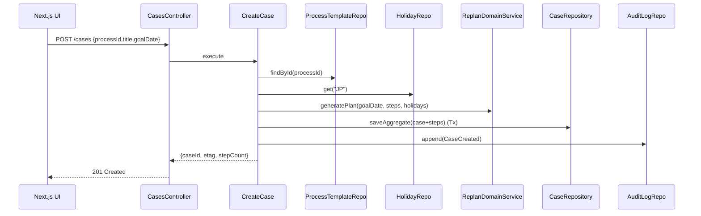
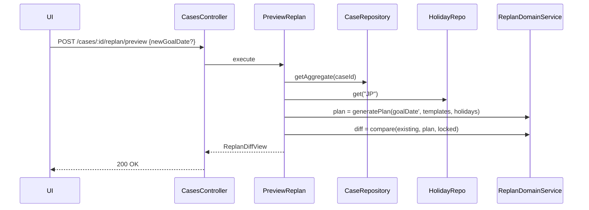
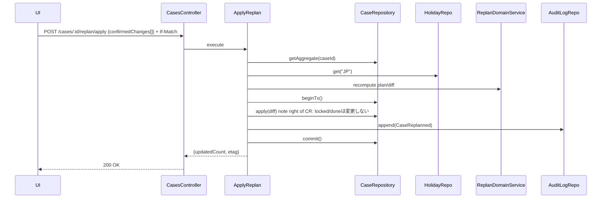
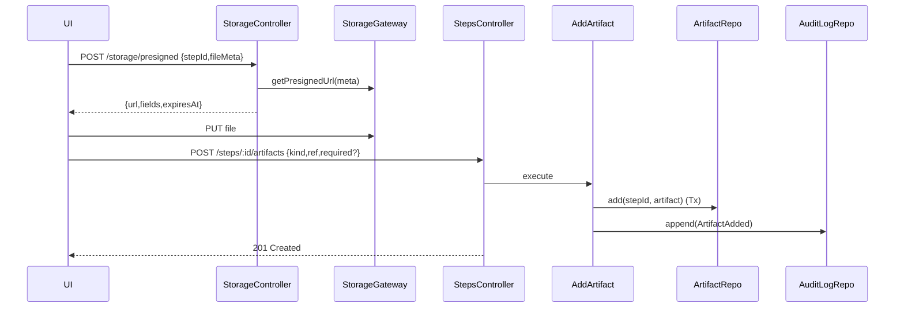
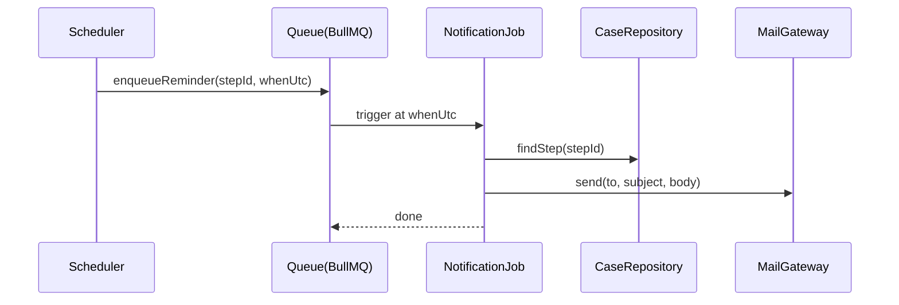
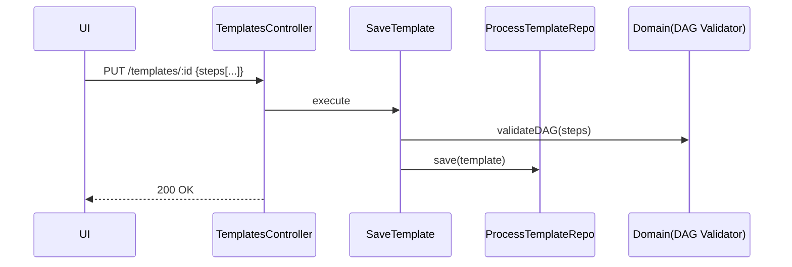
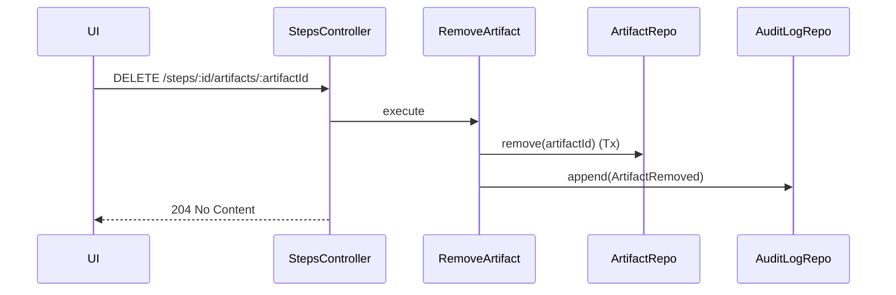
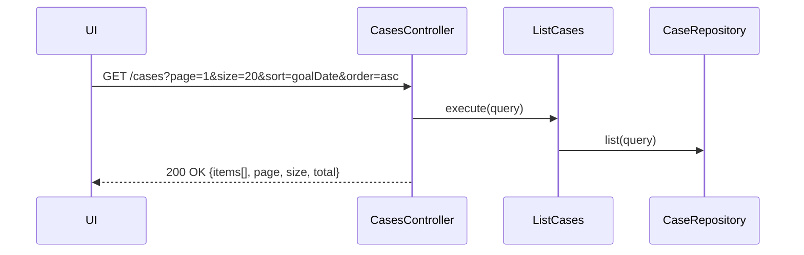

# 25 シーケンス図（Mermaid・完全版 v4）

## 1) 案件作成（CreateCase）

## 2) 再計算プレビュー（PreviewReplan）

## 3) 再計算適用（ApplyReplan, Tx）

## 4) 成果物登録（presigned + AddArtifact）

## 5) 期限前通知ジョブ

## 6) テンプレ保存（DAG検証）

## 7) アーティファクト削除

## 8) 案件一覧（ページング/検索）
