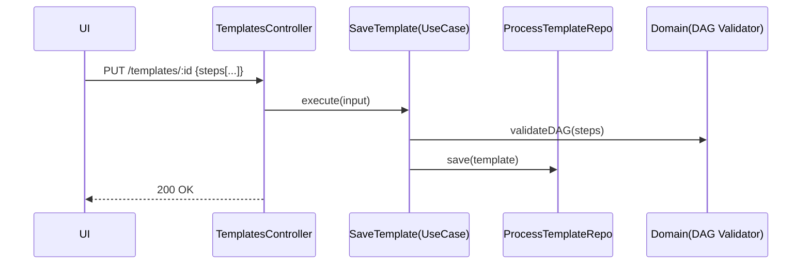
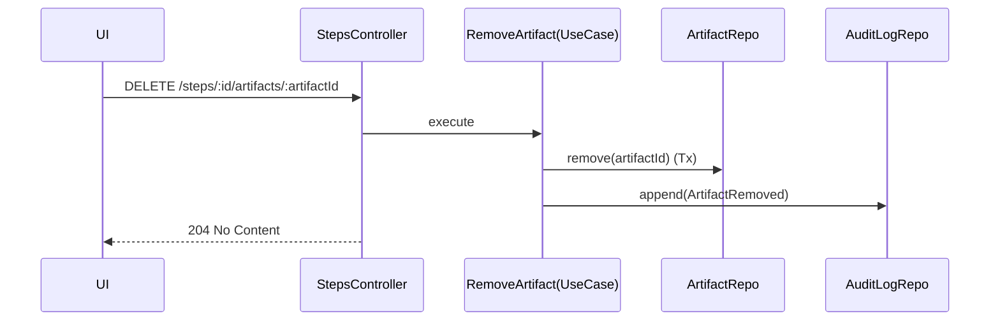
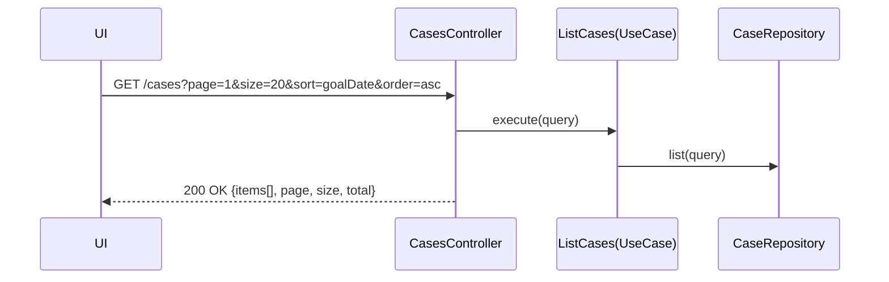

# 25 シーケンス図（追補 v2）

## 6) テンプレ保存（DAG検証）

```mermaid
sequenceDiagram
  participant UI
  participant C as TemplatesController
  participant UC as SaveTemplate(UseCase)
  participant PR as ProcessTemplateRepo
  participant D as Domain(DAG Validator)

  UI->>C: PUT /templates/:id {steps[...]}
  C->>UC: execute(input)
  UC->>D: validateDAG(steps)
  UC->>PR: save(template)
  C-->>UI: 200 OK
```

## 7) アーティファクト削除

```mermaid
sequenceDiagram
  participant UI
  participant C as StepsController
  participant UC as RemoveArtifact(UseCase)
  participant AR as ArtifactRepo
  participant A as AuditLogRepo

  UI->>C: DELETE /steps/:id/artifacts/:artifactId
  C->>UC: execute
  UC->>AR: remove(artifactId) (Tx)
  UC->>A: append(ArtifactRemoved)
  C-->>UI: 204 No Content
```

## 8) 案件一覧検索（ページング）

```mermaid
sequenceDiagram
  participant UI
  participant C as CasesController
  participant UC as ListCases(UseCase)
  participant CR as CaseRepository

  UI->>C: GET /cases?page=1&size=20&sort=goalDate&order=asc
  C->>UC: execute(query)
  UC->>CR: list(query)
  C-->>UI: 200 OK {items[], page, size, total}
```
