# AIエージェント機能 - クラス図設計書 v1.2

## 概要

本ドキュメントは、AIエージェント支援テンプレート作成機能の詳細クラス図を定義します。
各クラスのメソッド、プロパティ、依存関係を詳細に記述し、実装の設計図として機能します。

## 関連ドキュメント

- [技術設計書](./ai_agent_technical_design.md) - 全体アーキテクチャ・API設計
- [シーケンス図設計書](./ai_agent_sequence_diagram.md) - メソッド呼び出しフロー
- [Enum・型定義書](./ai_agent_enums_types.md) - 型安全性確保のための定義
- [データベース設計書](./ai_agent_database_design.md) - データ永続化設計

## クラス図

### Interface Layer (Controllers)

#### AIAgentController
```
class AIAgentController {
  - startInterviewUseCase: StartInterviewSessionUseCase
  - getInterviewUseCase: GetInterviewSessionUseCase
  - endInterviewUseCase: EndInterviewSessionUseCase
  - processMessageUseCase: ProcessUserMessageUseCase
  - getConversationUseCase: GetConversationHistoryUseCase
  - generateTemplateUseCase: GenerateTemplateRecommendationsUseCase
  - finalizeTemplateUseCase: FinalizeTemplateCreationUseCase
  - searchBestPracticesUseCase: SearchBestPracticesUseCase
  - searchComplianceUseCase: SearchComplianceRequirementsUseCase
  - searchBenchmarksUseCase: SearchProcessBenchmarksUseCase
  - getIndustriesUseCase: GetIndustryTemplatesUseCase
  - getProcessTypesUseCase: GetProcessTypesUseCase
  - collectFeedbackUseCase: CollectUserFeedbackUseCase
  
  + startSession(dto: StartSessionDto, user: User): Promise<SessionResponseDto>
  + getSession(sessionId: string, user: User): Promise<SessionResponseDto>
  + endSession(sessionId: string, user: User): Promise<void>
  + sendMessage(sessionId: string, dto: SendMessageDto, user: User): Promise<MessageResponseDto>
  + getMessages(sessionId: string, user: User): Promise<ConversationHistoryDto>
  + generateTemplate(sessionId: string, user: User): Promise<TemplateRecommendationDto>
  + finalizeTemplate(sessionId: string, dto: FinalizeTemplateDto, user: User): Promise<ProcessTemplateDto>
  + searchBestPractices(query: BestPracticesQueryDto): Promise<ResearchResultsDto>
  + searchCompliance(query: ComplianceQueryDto): Promise<ComplianceResultsDto>
  + searchBenchmarks(query: BenchmarksQueryDto): Promise<BenchmarkResultsDto>
  + getIndustries(): Promise<IndustryTemplatesDto>
  + getProcessTypes(): Promise<ProcessTypesDto>
  + submitFeedback(dto: FeedbackDto, user: User): Promise<void>
}
```

### Application Layer (Use Cases)

#### Knowledge Base Management Use Cases

##### GetIndustryTemplatesUseCase
```
class GetIndustryTemplatesUseCase {
  - knowledgeBaseManagerService: KnowledgeBaseManagerService
  
  + execute(input: GetIndustryTemplatesQueryDto): Promise<IndustryTemplatesResponseDto>
  - validateInput(input: GetIndustryTemplatesQueryDto): void
}
```

##### CreateIndustryTemplateUseCase
```
class CreateIndustryTemplateUseCase {
  - knowledgeBaseManagerService: KnowledgeBaseManagerService
  
  + execute(input: CreateIndustryTemplateDto): Promise<IndustryTemplateDto>
  - validateInput(input: CreateIndustryTemplateDto): void
}
```

##### UpdateIndustryTemplateUseCase
```
class UpdateIndustryTemplateUseCase {
  - knowledgeBaseManagerService: KnowledgeBaseManagerService
  
  + execute(id: string, input: UpdateIndustryTemplateDto): Promise<IndustryTemplateDto>
  - validateInput(id: string, input: UpdateIndustryTemplateDto): void
}
```

##### DeleteIndustryTemplateUseCase
```
class DeleteIndustryTemplateUseCase {
  - knowledgeBaseManagerService: KnowledgeBaseManagerService
  
  + execute(id: string): Promise<void>
  - validateInput(id: string): void
}
```

##### GetProcessTypesUseCase
```
class GetProcessTypesUseCase {
  - knowledgeBaseManagerService: KnowledgeBaseManagerService
  
  + execute(input: GetProcessTypesQueryDto): Promise<ProcessTypesResponseDto>
  - validateInput(input: GetProcessTypesQueryDto): void
}
```

##### CreateProcessTypeUseCase
```
class CreateProcessTypeUseCase {
  - knowledgeBaseManagerService: KnowledgeBaseManagerService
  
  + execute(input: CreateProcessTypeDto): Promise<ProcessTypeTemplateDto>
  - validateInput(input: CreateProcessTypeDto): void
}
```

##### UpdateProcessTypeUseCase
```
class UpdateProcessTypeUseCase {
  - knowledgeBaseManagerService: KnowledgeBaseManagerService
  
  + execute(id: string, input: UpdateProcessTypeDto): Promise<ProcessTypeTemplateDto>
  - validateInput(id: string, input: UpdateProcessTypeDto): void
}
```

##### DeleteProcessTypeUseCase
```
class DeleteProcessTypeUseCase {
  - knowledgeBaseManagerService: KnowledgeBaseManagerService
  
  + execute(id: string): Promise<void>
  - validateInput(id: string): void
}
```

##### GetBestPracticesUseCase
```
class GetBestPracticesUseCase {
  - knowledgeBaseManagerService: KnowledgeBaseManagerService
  
  + execute(input: GetBestPracticesQueryDto): Promise<BestPracticesResponseDto>
  - validateInput(input: GetBestPracticesQueryDto): void
}
```

##### CreateBestPracticeUseCase
```
class CreateBestPracticeUseCase {
  - knowledgeBaseManagerService: KnowledgeBaseManagerService
  
  + execute(input: CreateBestPracticeDto): Promise<BestPracticeDto>
  - validateInput(input: CreateBestPracticeDto): void
}
```

##### UpdateBestPracticeUseCase
```
class UpdateBestPracticeUseCase {
  - knowledgeBaseManagerService: KnowledgeBaseManagerService
  
  + execute(id: string, input: UpdateBestPracticeDto): Promise<BestPracticeDto>
  - validateInput(id: string, input: UpdateBestPracticeDto): void
}
```

##### BulkUpdateBestPracticesUseCase
```
class BulkUpdateBestPracticesUseCase {
  - knowledgeBaseManagerService: KnowledgeBaseManagerService
  
  + execute(input: BulkUpdateBestPracticesDto): Promise<BulkUpdateResultDto>
  - validateInput(input: BulkUpdateBestPracticesDto): void
}
```

#### StartInterviewSessionUseCase
```
class StartInterviewSessionUseCase {
  - sessionRepository: InterviewSessionRepository
  - conversationService: AIConversationService
  - configService: AIConfigService
  - rateLimitService: AIRateLimitService
  
  + execute(input: StartSessionInput): Promise<StartSessionOutput>
  - validateInput(input: StartSessionInput): void
  - checkRateLimit(userId: number): Promise<void>
  - createSession(input: StartSessionInput): Promise<InterviewSession>
  - generateWelcomeMessage(context: SessionContext): Promise<string>
}
```

#### ProcessUserMessageUseCase
```
class ProcessUserMessageUseCase {
  - sessionRepository: InterviewSessionRepository
  - conversationService: AIConversationService
  - analysisService: ProcessAnalysisService
  - rateLimitService: AIRateLimitService
  - monitoringService: AIMonitoringService

  + execute(input: ProcessMessageInput): Promise<ProcessMessageOutput>
  - validateInput(input: ProcessMessageInput): void
  - checkRateLimit(userId: number): Promise<void>
  - loadSession(sessionId: string): Promise<InterviewSession>
  - validateSession(session: InterviewSession): void
  - processMessage(session: InterviewSession, message: string): Promise<AIResponse>
  - extractRequirements(conversation: ConversationMessage[]): Promise<ProcessRequirement[]>
  - updateSession(session: InterviewSession): Promise<void>
  - handleOpenAIError(error: Error): Promise<AIResponse>
  - waitForRetry(backoffTime: number): Promise<void>
  - createFallbackResponse(): AIResponse
  - logUsage(userId: number, tokens: number, cost: number): void
}
```

#### GenerateTemplateRecommendationsUseCase
```
class GenerateTemplateRecommendationsUseCase {
  - sessionRepository: InterviewSessionRepository
  - templateService: TemplateRecommendationService
  - analysisService: ProcessAnalysisService
  - knowledgeRepository: ProcessKnowledgeRepository
  - researchService: WebResearchService
  - backgroundJobQueue: BackgroundJobQueue

  + execute(input: GenerateTemplateInput): Promise<GenerateTemplateOutput>
  - validateInput(input: GenerateTemplateInput): void
  - loadSession(sessionId: string): Promise<InterviewSession>
  - validateSession(session: InterviewSession): void
  - analyzeRequirements(requirements: ProcessRequirement[]): Promise<ProcessAnalysis>
  - searchKnowledgeBase(analysis: ProcessAnalysis): Promise<KnowledgeBaseResult[]>
  - enqueueWebResearch(analysis: ProcessAnalysis): Promise<string>
  - generateRecommendations(analysis: ProcessAnalysis, knowledge: KnowledgeBaseResult[], research: ResearchResult[]): Promise<TemplateRecommendation[]>
  - validateRecommendations(recommendations: TemplateRecommendation[]): Promise<ValidationResult>
  - saveRecommendations(sessionId: string, recommendations: TemplateRecommendation[]): Promise<void>
}
```

### Domain Layer (Services)

#### AIConversationService
```
class AIConversationService {
  - openAIService: OpenAIService
  - encryptionService: DataEncryptionService
  - cacheService: AICacheService
  
  + initializeSession(context: SessionContext): Promise<ConversationSession>
  + processMessage(session: ConversationSession, message: string): Promise<AIResponse>
  + generateWelcomeMessage(context: SessionContext): Promise<string>
  + generateFollowUpQuestions(conversation: ConversationMessage[]): Promise<string[]>
  + summarizeConversation(conversation: ConversationMessage[]): Promise<ConversationSummary>
  - buildPrompt(context: SessionContext, conversation: ConversationMessage[], message: string): string
  - parseAIResponse(response: string): AIResponse
  - validateResponse(response: AIResponse): boolean
  - encryptSensitiveData(data: any): string
  - decryptSensitiveData(encryptedData: string): any
}
```

#### TemplateRecommendationService
```
class TemplateRecommendationService {
  - openAIService: OpenAIService
  - knowledgeService: KnowledgeBaseService
  - validationService: TemplateValidationService
  
  + generateRecommendations(analysis: ProcessAnalysis, context: RecommendationContext): Promise<TemplateRecommendation[]>
  + validateRecommendations(recommendations: TemplateRecommendation[]): Promise<ValidationResult>
  + optimizeStepSequence(steps: StepRecommendation[]): Promise<StepRecommendation[]>
  + calculateConfidenceScores(recommendations: TemplateRecommendation[]): Promise<TemplateRecommendation[]>
  + generateAlternatives(primary: TemplateRecommendation): Promise<TemplateRecommendation[]>
  - buildTemplatePrompt(analysis: ProcessAnalysis, knowledge: KnowledgeBaseResult[]): string
  - parseTemplateResponse(response: string): TemplateRecommendation
  - validateStepDependencies(steps: StepRecommendation[]): boolean
  - detectCircularDependencies(steps: StepRecommendation[]): boolean
  - calculateCriticalPath(steps: StepRecommendation[]): StepRecommendation[]
}
```

#### ProcessAnalysisService
```
class ProcessAnalysisService {
  - openAIService: OpenAIService
  - nlpService: NaturalLanguageProcessingService
  
  + extractRequirements(conversation: ConversationMessage[]): Promise<ProcessRequirement[]>
  + analyzeRequirements(requirements: ProcessRequirement[]): Promise<ProcessAnalysis>
  + identifyStakeholders(requirements: ProcessRequirement[]): Promise<Stakeholder[]>
  + identifyDeliverables(requirements: ProcessRequirement[]): Promise<Deliverable[]>
  + identifyConstraints(requirements: ProcessRequirement[]): Promise<Constraint[]>
  + estimateComplexity(requirements: ProcessRequirement[]): Promise<ComplexityLevel>
  + categorizeProcess(requirements: ProcessRequirement[]): Promise<ProcessCategory>
  - extractEntities(text: string): Promise<Entity[]>
  - classifyIntent(message: string): Promise<Intent>
  - calculateConfidence(analysis: ProcessAnalysis): number
  - validateAnalysis(analysis: ProcessAnalysis): boolean
}
```

#### WebResearchService
```
class WebResearchService {
  - webSearchService: WebSearchService
  - cacheRepository: WebResearchCacheRepository
  - validationService: InformationValidationService

  + searchBestPractices(industry: string, processType: string): Promise<ResearchResult[]>
  + searchComplianceRequirements(industry: string, region: string): Promise<ComplianceInfo[]>
  + searchProcessBenchmarks(processType: string): Promise<BenchmarkData[]>
  + validateSources(results: ResearchResult[]): Promise<SourceReliability[]>
  + extractActionableInsights(results: ResearchResult[]): Promise<ProcessInsight[]>
  + crossReferenceInformation(results: ResearchResult[]): Promise<ValidationReport>
  - buildSearchQuery(parameters: SearchParameters): string
  - filterResults(results: RawSearchResult[]): ResearchResult[]
  - calculateRelevanceScore(result: RawSearchResult, query: string): number
  - extractKeyInsights(content: string): string[]
  - checkCache(queryHash: string): Promise<ResearchResult[]>
  - saveToCache(queryHash: string, results: ResearchResult[]): Promise<void>
}
```

#### InformationValidationService
```
class InformationValidationService {
  + validateSource(url: string): Promise<SourceReliability>
  + crossReferenceInformation(results: ResearchResult[]): Promise<ValidationReport>
  + extractActionableInsights(results: ResearchResult[]): Promise<ProcessInsight[]>
  + checkSourceCredibility(domain: string): Promise<CredibilityScore>
  + detectBias(content: string): Promise<BiasAnalysis>
  + verifyInformation(claim: string, sources: string[]): Promise<VerificationResult>
  - analyzeSourceMetadata(metadata: SourceMetadata): SourceReliability
  - calculateConsensusScore(sources: ResearchResult[]): number
}
```

#### KnowledgeBaseManagerService
```
class KnowledgeBaseManagerService {
  - processKnowledgeRepository: ProcessKnowledgeRepository
  - prismaService: PrismaService
  - logger: Logger
  
  + getIndustryTemplates(query: GetIndustryTemplatesQuery): Promise<IndustryTemplate[]>
  + createIndustryTemplate(data: CreateIndustryTemplateData): Promise<IndustryTemplate>
  + updateIndustryTemplate(id: string, data: UpdateIndustryTemplateData): Promise<IndustryTemplate>
  + deleteIndustryTemplate(id: string): Promise<void>
  + getProcessTypes(query: GetProcessTypesQuery): Promise<ProcessTypeTemplate[]>
  + createProcessType(data: CreateProcessTypeData): Promise<ProcessTypeTemplate>
  + updateProcessType(id: string, data: UpdateProcessTypeData): Promise<ProcessTypeTemplate>
  + deleteProcessType(id: string): Promise<void>
  + getBestPractices(query: GetBestPracticesQuery): Promise<BestPractice[]>
  + createBestPractice(data: CreateBestPracticeData): Promise<BestPractice>
  + updateBestPractice(id: string, data: UpdateBestPracticeData): Promise<BestPractice>
  + bulkUpdateBestPractices(updates: BulkUpdateData[]): Promise<void>
  + syncKnowledgeBase(): Promise<SyncResult>
  - validateIndustryTemplate(data: any): boolean
  - validateProcessType(data: any): boolean
  - validateBestPractice(data: any): boolean
  - logOperation(operation: string, result: any): void
}
```

### Domain Layer (Entities)

#### InterviewSession
```
class InterviewSession {
  - id: number
  - sessionId: SessionId
  - userId: number
  - status: SessionStatus
  - context: SessionContext
  - conversation: ConversationMessage[]
  - extractedRequirements: ProcessRequirement[]
  - generatedTemplate: TemplateRecommendation
  - createdAt: Date
  - updatedAt: Date
  - expiresAt: Date
  
  + addMessage(message: ConversationMessage): void
  + updateRequirements(requirements: ProcessRequirement[]): void
  + setGeneratedTemplate(template: TemplateRecommendation): void
  + markAsCompleted(): void
  + markAsExpired(): void
  + isActive(): boolean
  + isExpired(): boolean
  + canAddMessage(): boolean
  + getConversationSummary(): ConversationSummary
  + getLatestRequirements(): ProcessRequirement[]
  - validateMessage(message: ConversationMessage): boolean
  - updateTimestamp(): void
}
```

#### ConversationMessage
```
class ConversationMessage {
  - id: string
  - role: MessageRole
  - content: MessageContent
  - timestamp: Date
  - metadata: MessageMetadata
  
  + isFromUser(): boolean
  + isFromAssistant(): boolean
  + getTokenCount(): number
  + containsSensitiveData(): boolean
  + sanitize(): ConversationMessage
  - validateContent(): boolean
}
```

#### ProcessRequirement
```
class ProcessRequirement {
  - id: string
  - category: RequirementCategory
  - description: string
  - priority: Priority
  - confidence: ConfidenceScore
  - extractedFrom: string
  - entities: Entity[]
  
  + isHighPriority(): boolean
  + isMandatory(): boolean
  + getRelatedEntities(): Entity[]
  + merge(other: ProcessRequirement): ProcessRequirement
  - validateDescription(): boolean
}
```

### Domain Layer (Value Objects)

#### SessionId
```
class SessionId {
  - value: string
  
  + constructor(value: string)
  + getValue(): string
  + equals(other: SessionId): boolean
  + toString(): string
  - validate(value: string): boolean
}
```

#### MessageContent
```
class MessageContent {
  - value: string
  - tokenCount: number
  
  + constructor(value: string)
  + getValue(): string
  + getTokenCount(): number
  + isEmpty(): boolean
  + exceedsLimit(limit: number): boolean
  + sanitize(): MessageContent
  - calculateTokenCount(): number
  - validate(value: string): boolean
}
```

#### ConfidenceScore
```
class ConfidenceScore {
  - value: number
  
  + constructor(value: number)
  + getValue(): number
  + isHigh(): boolean
  + isMedium(): boolean
  + isLow(): boolean
  + combine(other: ConfidenceScore): ConfidenceScore
  - validate(value: number): boolean
}
```

### Infrastructure Layer (Repositories)

#### InterviewSessionRepository
```
interface InterviewSessionRepository {
  + save(session: InterviewSession): Promise<InterviewSession>
  + findById(sessionId: string): Promise<InterviewSession>
  + findByUserId(userId: number): Promise<InterviewSession[]>
  + findActiveByUserId(userId: number): Promise<InterviewSession[]>
  + findExpiredSessions(): Promise<InterviewSession[]>
  + updateConversation(sessionId: string, conversation: ConversationMessage[]): Promise<void>
  + updateRequirements(sessionId: string, requirements: ProcessRequirement[]): Promise<void>
  + updateGeneratedTemplate(sessionId: string, template: TemplateRecommendation): Promise<void>
  + markAsCompleted(sessionId: string): Promise<void>
  + markAsExpired(sessionId: string): Promise<void>
  + delete(sessionId: string): Promise<void>
  + deleteExpiredSessions(): Promise<number>
}
```

#### ProcessKnowledgeRepository
```
interface ProcessKnowledgeRepository {
  + findByCategory(category: string): Promise<ProcessKnowledge[]>
  + findByIndustry(industry: string): Promise<ProcessKnowledge[]>
  + findByProcessType(processType: string): Promise<ProcessKnowledge[]>
  + findBestPractices(industry: string, processType: string): Promise<BestPractice[]>
  + save(knowledge: ProcessKnowledge): Promise<ProcessKnowledge>
  + update(id: number, knowledge: ProcessKnowledge): Promise<ProcessKnowledge>
  + delete(id: number): Promise<void>
  + findActive(): Promise<ProcessKnowledge[]>
  + findByVersion(version: number): Promise<ProcessKnowledge[]>
}
```

### Infrastructure Layer (External Services)

#### OpenAIService
```
interface OpenAIService {
  + generateResponse(prompt: string, context: AIContext): Promise<AIResponse>
  + generateTemplate(requirements: ProcessRequirement[], context: TemplateContext): Promise<TemplateRecommendation>
  + extractEntities(text: string): Promise<Entity[]>
  + classifyIntent(message: string): Promise<Intent>
  + summarizeText(text: string): Promise<string>
  + validateResponse(response: string): Promise<boolean>
  + estimateTokens(text: string): number
  + checkRateLimit(userId: number): Promise<boolean>
}
```

#### WebSearchService
```
interface WebSearchService {
  + search(query: string, parameters: SearchParameters): Promise<RawSearchResult[]>
  + searchBestPractices(industry: string, processType: string): Promise<RawSearchResult[]>
  + searchCompliance(industry: string, region: string): Promise<RawSearchResult[]>
  + searchBenchmarks(processType: string): Promise<RawSearchResult[]>
  + validateSource(url: string): Promise<SourceReliability>
  + extractContent(url: string): Promise<string>
  + checkRateLimit(): Promise<boolean>
}
```

#### BackgroundJobQueue
```
interface BackgroundJobQueue {
  + enqueue(jobType: string, jobData: any): Promise<string>
  + process(jobType: string, processor: JobProcessor): void
  + getJobStatus(jobId: string): Promise<JobStatus>
  + cancelJob(jobId: string): Promise<void>
  + retryJob(jobId: string): Promise<void>
  + getQueueStats(): Promise<QueueStats>
}
```

#### AIProcessingProcessor
```
class AIProcessingProcessor {
  - webResearchService: WebResearchService
  - sessionRepository: InterviewSessionRepository
  - socketGateway: SocketGateway
  - logger: Logger

  + handleWebResearch(job: Job<WebResearchJobData>): Promise<void>
  + handleTemplateGeneration(job: Job<TemplateGenerationJobData>): Promise<void>
  + handleRequirementAnalysis(job: Job<RequirementAnalysisJobData>): Promise<void>
  - notifyJobComplete(sessionId: string, result: any): Promise<void>
  - notifyJobFailed(sessionId: string, error: Error): Promise<void>
  - logJobExecution(jobType: string, duration: number, success: boolean): void
}
```

#### SocketGateway
```
class SocketGateway {
  + notifyResearchComplete(sessionId: string, results: ResearchResult[]): void
  + notifyTemplateGenerated(sessionId: string, template: TemplateRecommendation): void
  + notifyRequirementsExtracted(sessionId: string, requirements: ProcessRequirement[]): void
  + notifySessionStatusChanged(sessionId: string, status: SessionStatus): void
  + notifyError(sessionId: string, error: ErrorInfo): void
  + joinSessionRoom(clientId: string, sessionId: string): void
  + leaveSessionRoom(clientId: string, sessionId: string): void
  - validateClient(clientId: string): boolean
  - getSessionRoom(sessionId: string): string
}
```

## クラス関係図

```mermaid
classDiagram
    %% Controller Layer
    class AIAgentController {
        -startInterviewUseCase: StartInterviewSessionUseCase
        -processMessageUseCase: ProcessUserMessageUseCase
        -generateTemplateUseCase: GenerateTemplateRecommendationsUseCase
        +startSession() SessionResponseDto
        +sendMessage() MessageResponseDto
        +generateTemplate() TemplateRecommendationDto
    }
    
    %% Use Case Layer
    class StartInterviewSessionUseCase {
        -sessionRepository: InterviewSessionRepository
        -conversationService: AIConversationService
        +execute() StartSessionOutput
    }
    
    class ProcessUserMessageUseCase {
        -sessionRepository: InterviewSessionRepository
        -conversationService: AIConversationService
        -analysisService: ProcessAnalysisService
        +execute() ProcessMessageOutput
    }
    
    class GenerateTemplateRecommendationsUseCase {
        -sessionRepository: InterviewSessionRepository
        -templateService: TemplateRecommendationService
        -analysisService: ProcessAnalysisService
        +execute() GenerateTemplateOutput
    }
    
    %% Domain Service Layer
    class AIConversationService {
        -openAIService: OpenAIService
        +processMessage() AIResponse
        +generateWelcomeMessage() string
    }
    
    class TemplateRecommendationService {
        -openAIService: OpenAIService
        -knowledgeService: KnowledgeBaseService
        +generateRecommendations() TemplateRecommendation[]
    }
    
    class ProcessAnalysisService {
        -openAIService: OpenAIService
        +extractRequirements() ProcessRequirement[]
        +analyzeRequirements() ProcessAnalysis
    }
    
    %% Domain Entity Layer
    class InterviewSession {
        -sessionId: SessionId
        -conversation: ConversationMessage[]
        -extractedRequirements: ProcessRequirement[]
        +addMessage() void
        +updateRequirements() void
    }
    
    class ConversationMessage {
        -role: MessageRole
        -content: MessageContent
        +isFromUser() boolean
    }
    
    class ProcessRequirement {
        -category: RequirementCategory
        -priority: Priority
        +isHighPriority() boolean
    }
    
    %% Repository Layer
    class InterviewSessionRepository {
        <<interface>>
        +save() InterviewSession
        +findById() InterviewSession
    }
    
    %% External Service Layer
    class OpenAIService {
        <<interface>>
        +generateResponse() AIResponse
        +generateTemplate() TemplateRecommendation
    }
    
    %% WebSocket Infrastructure Layer
    class SocketGateway {
        -server: Server
        -sessionRooms: Map
        -userSockets: Map
        -socketToUser: Map
        +handleConnection() void
        +handleDisconnect() void
        +handleJoinSession() void
        +handleLeaveSession() void
        +handleTypingIndicator() void
        +handleStatusRequest() void
        +sendToSession() void
        +sendToUser() void
        +broadcastConversationUpdate() void
        +broadcastStatusChange() void
        +notifySessionStatusChanged() void
        +notifyError() void
    }
    
    class SocketAuthGuard {
        -jwtService: JwtService
        -configService: ConfigService
        +canActivate() boolean
        -extractToken() string
        -validateToken() any
    }
    
    %% Relationships
    AIAgentController --> StartInterviewSessionUseCase
    AIAgentController --> ProcessUserMessageUseCase
    AIAgentController --> GenerateTemplateRecommendationsUseCase
    
    StartInterviewSessionUseCase --> InterviewSessionRepository
    StartInterviewSessionUseCase --> AIConversationService
    
    ProcessUserMessageUseCase --> InterviewSessionRepository
    ProcessUserMessageUseCase --> AIConversationService
    ProcessUserMessageUseCase --> ProcessAnalysisService
    
    GenerateTemplateRecommendationsUseCase --> InterviewSessionRepository
    GenerateTemplateRecommendationsUseCase --> TemplateRecommendationService
    GenerateTemplateRecommendationsUseCase --> ProcessAnalysisService
    
    AIConversationService --> OpenAIService
    TemplateRecommendationService --> OpenAIService
    ProcessAnalysisService --> OpenAIService
    
    InterviewSession --> ConversationMessage
    InterviewSession --> ProcessRequirement
    
    %% WebSocket Relationships
    SocketGateway --> GetInterviewSessionUseCase
    SocketGateway --> SocketAuthGuard
```



### Infrastructure Layer (WebSocket)

#### SocketGateway
```
class SocketGateway {
  - server: Server
  - logger: Logger
  - sessionRooms: Map<string, AISessionRoom>
  - userSockets: Map<number, Set<string>>
  - socketToUser: Map<string, number>
  - getSessionUseCase: GetInterviewSessionUseCase
  
  + afterInit(server: Server): void
  + handleConnection(client: Socket): Promise<void>
  + handleDisconnect(client: Socket): Promise<void>
  + handleJoinSession(data: {sessionId: string}, client: Socket): Promise<void>
  + handleLeaveSession(data: {sessionId: string}, client: Socket): Promise<void>
  + handleTypingIndicator(data: WsTypingIndicatorDto, client: Socket): Promise<void>
  + handleStatusRequest(data: WsRequestSessionStatusDto, client: Socket): Promise<void>
  + sendToSession(sessionId: string, notification: AINotification): void
  + sendToUser(userId: number, event: string, data: any): void
  + broadcastConversationUpdate(sessionId: string, message: any): void
  + broadcastStatusChange(sessionId: string, status: string): void
  + broadcastProgress(sessionId: string, progress: number, message: string): void
  + broadcastTemplateGenerated(sessionId: string, template: any): void
  + broadcastError(sessionId: string, error: string): void
  + notifyResearchComplete(sessionId: string, results: any[]): void
  + notifyTemplateGenerated(sessionId: string, template: any): void
  + notifyRequirementsExtracted(sessionId: string, requirements: any[]): void
  + notifySessionStatusChanged(sessionId: string, status: string): void
  + notifyError(sessionId: string, error: any): void
  + getSessionStats(sessionId: string): object
  + getActiveSessions(): string[]
  + isUserConnected(userId: number): boolean
  - extractUserId(client: Socket): number | null
}
```

#### SocketAuthGuard
```
class SocketAuthGuard {
  - logger: Logger
  - jwtService: JwtService
  - configService: ConfigService
  
  + canActivate(context: ExecutionContext): Promise<boolean>
  - extractToken(client: Socket): string | null
  - validateToken(token: string): Promise<any>
  + static validateRole(client: Socket, requiredRole: string): boolean
  + static validatePermission(client: Socket, permission: string): boolean
  + static getUserId(client: Socket): number | null
  + static validateOwnership(client: Socket, resourceType: string, resourceId: string | number, checkOwnership: Function): Promise<boolean>
}
```

### WebSocket DTOs

#### WsSessionStatusDto
```
class WsSessionStatusDto {
  + sessionId: string
  + status: SessionStatus
  + reason?: string
  + timestamp: string
}
```

#### WsMessageNotificationDto
```
class WsMessageNotificationDto {
  + sessionId: string
  + messageId: string
  + role: MessageRole
  + content: string
  + metadata?: MessageMetadata
  + timestamp: string
}
```

#### WsTypingIndicatorDto
```
class WsTypingIndicatorDto {
  + sessionId: string
  + isTyping: boolean
  + estimatedTime?: number
  + stage?: 'thinking' | 'researching' | 'analyzing' | 'generating'
}
```

#### WsTemplateProgressDto
```
class WsTemplateProgressDto {
  + sessionId: string
  + stage: 'analyzing' | 'researching' | 'generating' | 'validating' | 'finalizing'
  + progress: number
  + message: string
  + estimatedTimeRemaining?: number
  + timestamp: string
}
```

#### WsTemplateCompletedDto
```
class WsTemplateCompletedDto {
  + sessionId: string
  + templateId: string
  + success: boolean
  + message?: string
  + timestamp: string
}
```

#### WsRequestSessionStatusDto
```
class WsRequestSessionStatusDto {
  + sessionId: string
}
```

#### WsErrorNotificationDto
```
class WsErrorNotificationDto {
  + sessionId: string
  + code: string
  + message: string
  + details?: Record<string, any>
  + retryable: boolean
  + timestamp: string
}
```

#### WsResearchProgressDto
```
class WsResearchProgressDto {
  + sessionId: string
  + stage: 'querying' | 'analyzing' | 'validating'
  + progress: number
  + sourcesAnalyzed: number
  + currentSource?: string
  + timestamp: string
}
```

### WebSocket Supporting Types

#### AISessionRoom
```
class AISessionRoom {
  + sessionId: string
  + userId: number
  + sockets: Set<string>
}
```

#### AINotification
```
class AINotification {
  + type: 'message' | 'status' | 'progress' | 'error' | 'template'
  + sessionId: string
  + data: any
  + timestamp: Date
}
```

---

**本クラス図は実装チームが参照する詳細設計図です。次のステップでシーケンス図を作成し、メソッド呼び出しの詳細を定義します。**
