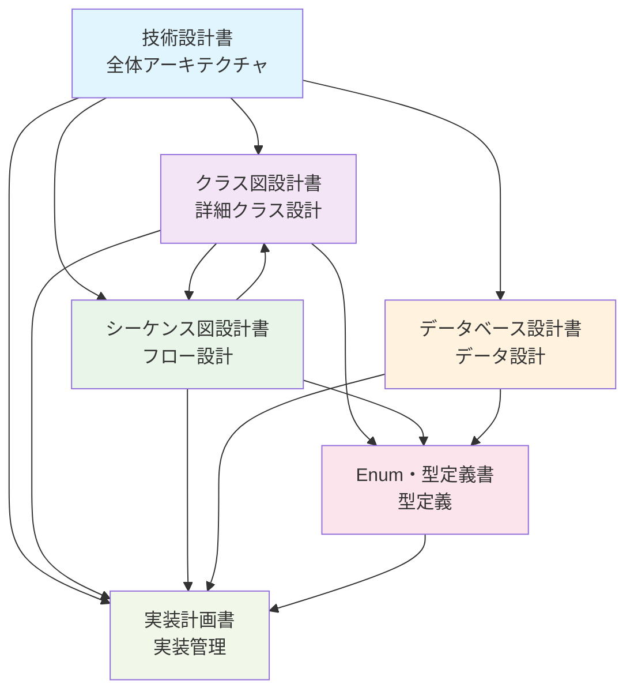

# AIエージェント機能 - ドキュメント索引 v1.2

## 概要

本ドキュメントは、AIエージェント支援テンプレート作成機能の設計ドキュメント群の索引です。
各ドキュメントの役割・内容・相互関係を明確化し、効率的な設計情報アクセスを提供します。

## ドキュメント構成

### 📋 設計ドキュメント一覧

| ドキュメント | 役割 | 主要内容 | 対象読者 |
|-------------|------|----------|----------|
| [技術設計書](./ai_agent_technical_design.md) | **全体設計** | アーキテクチャ・API・環境設定 | 全開発者・アーキテクト |
| [クラス図設計書](./ai_agent_class_diagram.md) | **詳細設計** | 全クラスのメソッド・プロパティ | Backend開発者 |
| [シーケンス図設計書](./ai_agent_sequence_diagram.md) | **フロー設計** | メソッド呼び出しシーケンス | Backend開発者 |
| [Enum・型定義書](./ai_agent_enums_types.md) | **型定義** | 型安全性確保のための定義 | 全開発者 |
| [データベース設計書](./ai_agent_database_design.md) | **データ設計** | テーブル・インデックス・最適化 | Backend・DB開発者 |
| [実装計画書](./ai_agent_implementation_plan.md) | **実装管理** | タスク・スケジュール・工数 | プロジェクトマネージャー |

### 🔄 ドキュメント間関係

## 各ドキュメントの詳細

### 1. 技術設計書 (ai_agent_technical_design.md)

**役割**: システム全体の技術アーキテクチャ定義

**主要内容**:
- 全体アーキテクチャ図
- API エンドポイント定義
- エンドポイント → 実装クラス群マッピング
- データフロー概要
- 環境設定・セキュリティ方針

**特徴**:
- 他ドキュメントへの参照中心
- 実装コード例は削除済み（冗長性排除）
- アーキテクチャレベルの意思決定記録

### 2. クラス図設計書 (ai_agent_class_diagram.md)

**役割**: 全クラスの詳細設計定義

**主要内容**:
- 各レイヤーの全クラス定義
- メソッド・プロパティの詳細仕様
- クラス間依存関係
- インターフェース定義

**特徴**:
- 実装直前の詳細度
- シーケンス図との整合性確保済み
- 型定義書との連携

### 3. シーケンス図設計書 (ai_agent_sequence_diagram.md)

**役割**: メソッド呼び出しフローの詳細定義

**主要内容**:
- 5つの主要フローのシーケンス図
- エラーハンドリングフロー
- 非同期処理フロー
- メソッド呼び出し詳細

**特徴**:
- クラス図との双方向フィードバック済み
- 実装時の呼び出し順序ガイド
- 例外処理パターン定義

### 4. Enum・型定義書 (ai_agent_enums_types.md)

**役割**: 型安全性確保のための包括的定義

**主要内容**:
- 全Enum定義（10種類）
- インターフェース・型定義（30種類以上）
- 定数定義
- バリデーション定数

**特徴**:
- TypeScript実装直結
- ドメイン知識の明文化
- 型安全性の確保

### 5. データベース設計書 (ai_agent_database_design.md)

**役割**: データ永続化の包括的設計

**主要内容**:
- 6つの新規テーブル設計
- インデックス・制約・パーティショニング
- JSONBスキーマ定義
- パフォーマンス最適化・セキュリティ

**特徴**:
- 技術設計書から分離（冗長性排除）
- 運用面まで考慮した設計
- データ保持ポリシー定義

### 6. 実装計画書 (ai_agent_implementation_plan.md)

**役割**: 実装プロジェクトの管理・進行

**主要内容**:
- フェーズ別実装計画
- タスク・工数・担当者
- エンドポイント対応関係
- 依存関係・リスク管理

**特徴**:
- 他ドキュメントとの整合性確保
- 実装可能性の検証済み
- プロジェクト管理ツール連携可能

## 冗長性排除の成果

### ✅ 排除された重複

#### 1. **データベース設計の重複**
- **Before**: 技術設計書 + データベース設計書で同じテーブル定義
- **After**: 技術設計書は概要のみ、詳細はデータベース設計書に集約

#### 2. **実装コード例の重複**
- **Before**: 技術設計書にTypeScript実装例
- **After**: クラス図設計書のメソッド定義に集約、技術設計書は参照のみ

#### 3. **型定義の散在**
- **Before**: 各ドキュメントに型定義が散在
- **After**: Enum・型定義書に一元化

### 🎯 整理後の特徴

#### 1. **単一責任原則**
- 各ドキュメントが明確な役割を持つ
- 情報の重複なし
- 更新時の整合性確保

#### 2. **相互参照システム**
- 適切なドキュメント間リンク
- 情報の階層化
- 効率的な情報アクセス

#### 3. **保守性向上**
- 変更時の影響範囲明確
- 一箇所更新で全体整合性確保
- レビュー効率向上

## 利用ガイド

### 🎯 目的別ドキュメント選択

#### **システム全体を理解したい**
1. [技術設計書](./ai_agent_technical_design.md) - アーキテクチャ概要
2. [実装計画書](./ai_agent_implementation_plan.md) - 実装スコープ

#### **実装を開始したい**
1. [クラス図設計書](./ai_agent_class_diagram.md) - 実装対象クラス
2. [シーケンス図設計書](./ai_agent_sequence_diagram.md) - 呼び出しフロー
3. [Enum・型定義書](./ai_agent_enums_types.md) - 型定義

#### **データベースを構築したい**
1. [データベース設計書](./ai_agent_database_design.md) - 全テーブル設計

#### **プロジェクトを管理したい**
1. [実装計画書](./ai_agent_implementation_plan.md) - タスク・スケジュール

### 📝 更新時の注意事項

#### **設計変更時の更新順序**
1. **技術設計書** - アーキテクチャ変更
2. **クラス図設計書** - クラス設計変更
3. **シーケンス図設計書** - フロー変更
4. **Enum・型定義書** - 型定義変更
5. **データベース設計書** - データ設計変更
6. **実装計画書** - 実装計画調整

#### **整合性チェックポイント**
- エンドポイント ↔ クラス ↔ シーケンスの一致
- 型定義の一貫性
- データベーススキーマとクラス設計の整合性

## まとめ

**反復型詳細化設計作業により、以下を実現：**

✅ **完全性**: 漏れ抜けのない包括的設計  
✅ **整合性**: ドキュメント間の完全一致  
✅ **効率性**: 冗長性排除による保守性向上  
✅ **実装可能性**: コーディング直接可能な詳細度  

**実装チームは本ドキュメント群を基に、確実で高品質な開発を進めることができます。**
