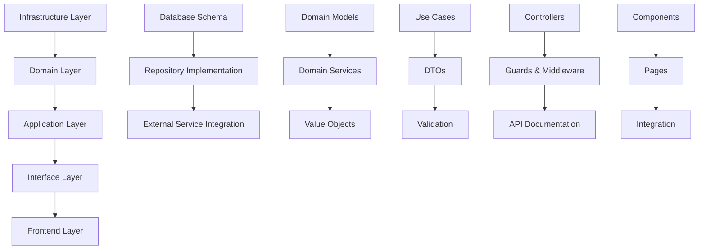

# AIエージェント支援テンプレート作成機能 - 実装計画書 v1.2

## 概要

本ドキュメントは、AIエージェント支援テンプレート作成機能の詳細な実装計画を記述します。
レイヤー依存関係を考慮した実装順序、具体的なタスク、対象ファイル、工数見積もりを詳述します。

## 実装戦略

### レイヤー依存関係



### 実装クラス群とAPIエンドポイントの関係

**全ての実装予定クラスは、APIエンドポイントから（アーキテクチャのレイヤーに従って）呼び出される設計になっています。**

#### 呼び出し関係の概要
```
APIエンドポイント → Controller → UseCase → Domain Service → Repository/External Service
```

#### 主要な実装クラス群
- **Controller層**: `AIAgentController` - 13のエンドポイントを実装
- **UseCase層**: 13のユースケースクラス - 各エンドポイントに1対1対応
- **Domain Service層**: 6のドメインサービス - 複数のユースケースから共有利用
- **Repository/External層**: 8のリポジトリ・外部サービス - データ永続化・外部API連携

詳細なマッピングは技術設計書の「エンドポイント → 実装クラス群マッピング」を参照してください。

### 実装フェーズ

## Phase 1: インフラストラクチャ基盤構築（5週間）

### Week 1: データベース・設定基盤

#### Task 1.1: データベーススキーマ作成
**工数**: 2日
**担当**: Backend Developer

**新規作成ファイル**:
```
api/prisma/migrations/20250820000001_add_ai_agent_tables/
├── migration.sql
└── README.md

api/prisma/schema.prisma (修正)
```

**作業内容**:
- [ ] [データベース設計書](./ai_agent_database_design.md) に基づく6テーブル作成
- [ ] インデックス・制約・パーティショニング設定
- [ ] マイグレーションファイル作成
- [ ] データ保持ポリシー実装

#### Task 1.2: 環境変数・設定管理
**工数**: 1日
**担当**: Backend Developer

**新規作成ファイル**:
```
api/src/config/ai-config.service.ts
api/src/config/ai-config.module.ts
```

**修正ファイル**:
```
api/.env.example
api/.env.development
api/src/app.module.ts
```

**作業内容**:
- [ ] AI関連環境変数定義
- [ ] AIConfigServiceクラス実装
- [ ] 設定バリデーション実装
- [ ] 環境別設定ファイル更新

#### Task 1.3: バックグラウンドジョブ基盤
**工数**: 3日
**担当**: Backend Developer

**新規作成ファイル**:
```
api/src/infrastructure/queue/
├── background-job-queue.interface.ts
├── bull-job-queue.service.ts
├── job-processor.interface.ts
└── queue.module.ts

api/src/infrastructure/processors/
├── ai-processing.processor.ts
└── processors.module.ts
```

**作業内容**:
- [ ] BackgroundJobQueueインターフェース定義
- [ ] Bull/Redis基盤のジョブキュー実装
- [ ] AIProcessingProcessorクラス実装
- [ ] ジョブ状態管理・リトライ機能実装
- [ ] ジョブ監視・統計機能実装

#### Task 1.4: リアルタイム通知基盤
**工数**: 2日
**担当**: Backend Developer

**新規作成ファイル**:
```
api/src/infrastructure/websocket/
├── socket.gateway.ts
├── socket-auth.guard.ts
└── websocket.module.ts
```

**作業内容**:
- [ ] SocketGatewayクラス実装
- [ ] WebSocket認証・認可実装
- [ ] セッションルーム管理実装
- [ ] リアルタイム通知機能実装

#### Task 1.5: 外部API統合基盤
**工数**: 3日
**担当**: Backend Developer

**新規作成ファイル**:
```
api/src/infrastructure/ai/
├── openai.service.ts
├── web-search.service.ts
├── ai-client.interface.ts
└── ai.module.ts

api/src/infrastructure/external/
├── http-client.service.ts
└── rate-limiter.service.ts
```

**作業内容**:
- [ ] OpenAI APIクライアント実装
- [ ] Web検索APIクライアント実装
- [ ] HTTPクライアント共通化
- [ ] レート制限機能実装
- [ ] エラーハンドリング実装
- [ ] リトライ機能実装

### Week 2: ドメイン層基盤

#### Task 1.4: ドメインモデル実装
**工数**: 3日
**担当**: Backend Developer

**新規作成ファイル**:
```
api/src/domain/ai-agent/
├── entities/
│   ├── interview-session.entity.ts
│   ├── conversation-message.entity.ts
│   └── process-requirement.entity.ts
├── value-objects/
│   ├── session-id.vo.ts
│   ├── message-content.vo.ts
│   └── confidence-score.vo.ts
└── enums/
    ├── session-status.enum.ts
    └── message-role.enum.ts
```

**作業内容**:
- [ ] InterviewSessionエンティティ実装
- [ ] ConversationMessageエンティティ実装
- [ ] ProcessRequirementエンティティ実装
- [ ] 値オブジェクト実装
- [ ] ドメインルール実装
- [ ] バリデーション実装

#### Task 1.5: リポジトリインターフェース定義
**工数**: 2日
**担当**: Backend Developer

**新規作成ファイル**:
```
api/src/domain/ai-agent/repositories/
├── interview-session.repository.interface.ts
├── process-knowledge.repository.interface.ts
└── template-generation-history.repository.interface.ts
```

**作業内容**:
- [ ] リポジトリインターフェース定義
- [ ] メソッドシグネチャ設計
- [ ] 戻り値型定義
- [ ] 例外定義

### Week 3: リポジトリ実装

#### Task 1.6: Prismaリポジトリ実装
**工数**: 4日
**担当**: Backend Developer

**新規作成ファイル**:
```
api/src/infrastructure/repositories/
├── prisma-interview-session.repository.ts
├── prisma-process-knowledge.repository.ts
├── prisma-template-generation-history.repository.ts
└── prisma-web-research-cache.repository.ts
```

**作業内容**:
- [ ] InterviewSessionRepository実装
- [ ] ProcessKnowledgeRepository実装
- [ ] TemplateGenerationHistoryRepository実装
- [ ] WebResearchCacheRepository実装
- [ ] トランザクション処理実装
- [ ] エラーハンドリング実装

#### Task 1.7: キャッシュサービス実装
**工数**: 2日
**担当**: Backend Developer

**新規作成ファイル**:
```
api/src/infrastructure/cache/
├── ai-cache.service.ts
├── cache-key.generator.ts
└── cache.module.ts
```

**作業内容**:
- [ ] Redisキャッシュサービス実装
- [ ] キャッシュキー生成戦略実装
- [ ] TTL管理実装
- [ ] キャッシュ無効化実装

### Week 4: セキュリティ・監視基盤

#### Task 1.8: セキュリティ機能実装
**工数**: 3日
**担当**: Backend Developer

**新規作成ファイル**:
```
api/src/infrastructure/security/
├── data-encryption.service.ts
├── ai-rate-limit.service.ts
├── privacy-manager.service.ts
└── security.module.ts
```

**作業内容**:
- [ ] データ暗号化サービス実装
- [ ] AIレート制限サービス実装
- [ ] プライバシー管理サービス実装
- [ ] 監査ログ機能実装

#### Task 1.9: 監視・ログ機能実装
**工数**: 2日
**担当**: Backend Developer

**新規作成ファイル**:
```
api/src/infrastructure/monitoring/
├── ai-monitoring.service.ts
├── metrics.service.ts
└── monitoring.module.ts
```

**作業内容**:
- [ ] AI利用監視サービス実装
- [ ] メトリクス収集実装
- [ ] 構造化ログ実装
- [ ] アラート機能実装

## Phase 2: アプリケーション層実装（8週間）

### Week 5: 非同期処理・通知基盤統合

#### Task 2.0: バックグラウンドジョブ・WebSocket統合
**工数**: 3日
**担当**: Backend Developer

**修正ファイル**:
```
api/src/app.module.ts
api/src/infrastructure/queue/queue.module.ts
api/src/infrastructure/websocket/websocket.module.ts
```

**作業内容**:
- [ ] バックグラウンドジョブキューとアプリケーション統合
- [ ] WebSocketゲートウェイとアプリケーション統合
- [ ] ジョブプロセッサーの登録・設定
- [ ] リアルタイム通知フローのテスト
- [ ] エラーハンドリング・リトライ機能テスト

### Week 6-7: コアユースケース実装

#### Task 2.1: インタビューセッション管理
**工数**: 4日
**担当**: Backend Developer
**対応エンドポイント**:
- `POST /api/ai-agent/sessions`
- `GET /api/ai-agent/sessions/{sessionId}`
- `DELETE /api/ai-agent/sessions/{sessionId}`

**新規作成ファイル**:
```
api/src/application/usecases/ai-agent/
├── start-interview-session.usecase.ts
├── get-interview-session.usecase.ts
├── end-interview-session.usecase.ts
└── cleanup-expired-sessions.usecase.ts

api/src/application/dto/ai-agent/
├── start-session.dto.ts
├── session-response.dto.ts
└── session-context.dto.ts
```

**作業内容**:
- [ ] セッション開始ユースケース実装
- [ ] セッション取得ユースケース実装
- [ ] セッション終了ユースケース実装
- [ ] 期限切れセッション清理実装
- [ ] DTO定義・バリデーション実装

#### Task 2.2: 対話処理ユースケース
**工数**: 5日
**担当**: Backend Developer
**対応エンドポイント**:
- `POST /api/ai-agent/sessions/{sessionId}/messages`
- `GET /api/ai-agent/sessions/{sessionId}/messages`

**新規作成ファイル**:
```
api/src/application/usecases/ai-agent/
├── process-user-message.usecase.ts
├── get-conversation-history.usecase.ts
├── extract-requirements.usecase.ts
└── analyze-conversation.usecase.ts

api/src/application/dto/ai-agent/
├── send-message.dto.ts
├── message-response.dto.ts
└── requirement-extraction.dto.ts
```

**作業内容**:
- [ ] ユーザーメッセージ処理実装
- [ ] 会話履歴取得実装
- [ ] 要件抽出ロジック実装
- [ ] 会話分析機能実装
- [ ] AI応答生成実装
- [ ] コンテキスト管理実装

### Week 8-9: テンプレート生成機能

#### Task 2.3: テンプレート推奨エンジン
**工数**: 6日
**担当**: Backend Developer
**対応エンドポイント**:
- `POST /api/ai-agent/sessions/{sessionId}/generate-template`
- `POST /api/ai-agent/sessions/{sessionId}/finalize-template`

**新規作成ファイル**:
```
api/src/application/usecases/ai-agent/
├── generate-template-recommendations.usecase.ts
├── validate-template-recommendations.usecase.ts
└── finalize-template-creation.usecase.ts

api/src/domain/services/
├── template-recommendation.service.ts
├── process-analysis.service.ts
└── knowledge-base.service.ts
```

**作業内容**:
- [ ] テンプレート推奨ユースケース実装
- [ ] 推奨検証ユースケース実装
- [ ] テンプレート確定ユースケース実装
- [ ] 推奨エンジンドメインサービス実装
- [ ] プロセス分析サービス実装

#### Task 2.4: Web検索・リサーチ機能
**工数**: 4日
**担当**: Backend Developer
**対応エンドポイント**:
- `GET /api/ai-agent/research/best-practices`
- `GET /api/ai-agent/research/compliance`
- `GET /api/ai-agent/research/benchmarks`

**新規作成ファイル**:
```
api/src/application/usecases/ai-agent/
├── search-best-practices.usecase.ts
├── search-compliance-requirements.usecase.ts
└── search-process-benchmarks.usecase.ts

api/src/domain/services/
├── web-research.service.ts
└── information-validation.service.ts
```

**作業内容**:
- [ ] ベストプラクティス検索実装
- [ ] コンプライアンス要件検索実装
- [ ] プロセスベンチマーク検索実装
- [ ] InformationValidationService実装
- [ ] 情報源信頼性検証機能実装
- [ ] バイアス検出・クロスリファレンス機能実装
- [ ] 検索結果統合・分析実装

### Week 10-11: 知識ベース・学習機能

#### Task 2.5: 知識ベース管理
**工数**: 4日
**担当**: Backend Developer
**対応エンドポイント**:
- Industry Templates (業界テンプレート)
  - `GET /api/ai-agent/knowledge/industries` - 業界テンプレート一覧取得
  - `POST /api/ai-agent/knowledge/industries` - 業界テンプレート作成
  - `PUT /api/ai-agent/knowledge/industries/:id` - 業界テンプレート更新
  - `DELETE /api/ai-agent/knowledge/industries/:id` - 業界テンプレート削除
- Process Types (プロセス種別)
  - `GET /api/ai-agent/knowledge/process-types` - プロセス種別一覧取得
  - `POST /api/ai-agent/knowledge/process-types` - プロセス種別作成
  - `PUT /api/ai-agent/knowledge/process-types/:id` - プロセス種別更新
  - `DELETE /api/ai-agent/knowledge/process-types/:id` - プロセス種別削除
- Best Practices (ベストプラクティス)
  - `GET /api/ai-agent/knowledge/best-practices` - ベストプラクティス一覧取得
  - `POST /api/ai-agent/knowledge/best-practices` - ベストプラクティス作成
  - `PUT /api/ai-agent/knowledge/best-practices/:id` - ベストプラクティス更新
  - `POST /api/ai-agent/knowledge/best-practices/bulk-update` - ベストプラクティス一括更新

**新規作成ファイル**:
```
api/src/application/usecases/knowledge-base/
├── get-industry-templates.usecase.ts
├── create-industry-template.usecase.ts
├── update-industry-template.usecase.ts
├── delete-industry-template.usecase.ts
├── get-process-types.usecase.ts
├── create-process-type.usecase.ts
├── update-process-type.usecase.ts
├── delete-process-type.usecase.ts
├── get-best-practices.usecase.ts
├── create-best-practice.usecase.ts
├── update-best-practice.usecase.ts
└── bulk-update-best-practices.usecase.ts

api/src/domain/services/
└── knowledge-base-manager.service.ts
```

**作業内容**:
- [ ] 業界テンプレート取得ユースケース実装
- [ ] 業界テンプレート作成ユースケース実装
- [ ] 業界テンプレート更新ユースケース実装
- [ ] 業界テンプレート削除ユースケース実装
- [ ] プロセス種別取得ユースケース実装
- [ ] プロセス種別作成ユースケース実装
- [ ] プロセス種別更新ユースケース実装
- [ ] プロセス種別削除ユースケース実装
- [ ] ベストプラクティス取得ユースケース実装
- [ ] ベストプラクティス作成ユースケース実装
- [ ] ベストプラクティス更新ユースケース実装
- [ ] ベストプラクティス一括更新ユースケース実装
- [ ] 知識ベース同期機能実装

#### Task 2.6: フィードバック・学習機能
**工数**: 3日
**担当**: Backend Developer
**対応エンドポイント**:
- `POST /api/ai-agent/knowledge/feedback`

**新規作成ファイル**:
```
api/src/application/usecases/ai-agent/
├── collect-user-feedback.usecase.ts
├── analyze-usage-patterns.usecase.ts
└── improve-recommendations.usecase.ts
```

**作業内容**:
- [ ] ユーザーフィードバック収集実装
- [ ] 利用パターン分析実装
- [ ] 推奨精度向上機能実装

## Phase 3: インターフェース層実装（4週間）

### Week 12: API Controller実装

#### Task 3.1: AIエージェントController
**工数**: 4日
**担当**: Backend Developer
**対応エンドポイント**: **全13エンドポイント**
- セッション管理: `POST/GET/DELETE /api/ai-agent/sessions`
- 対話処理: `POST/GET /api/ai-agent/sessions/{id}/messages`
- テンプレート生成: `POST /api/ai-agent/sessions/{id}/generate-template`
- テンプレート確定: `POST /api/ai-agent/sessions/{id}/finalize-template`
- Web検索: `GET /api/ai-agent/research/*`
- 知識ベース: `GET /api/ai-agent/knowledge/*`
- フィードバック: `POST /api/ai-agent/knowledge/feedback`

**新規作成ファイル**:
```
api/src/interfaces/controllers/
└── ai-agent.controller.ts

api/src/interfaces/guards/
├── ai-rate-limit.guard.ts
└── ai-feature-flag.guard.ts

api/src/interfaces/decorators/
└── ai-audit-log.decorator.ts
```

**修正ファイル**:
```
api/src/app.module.ts
```

**作業内容**:
- [ ] AIエージェントController実装（13エンドポイント）
- [ ] レート制限ガード実装
- [ ] 機能フラグガード実装
- [ ] 監査ログデコレーター実装
- [ ] OpenAPI仕様書生成

#### Task 3.2: バリデーション・エラーハンドリング
**工数**: 3日
**担当**: Backend Developer

**新規作成ファイル**:
```
api/src/interfaces/validators/
├── ai-message.validator.ts
├── session-context.validator.ts
└── template-generation.validator.ts

api/src/interfaces/filters/
└── ai-exception.filter.ts
```

**作業内容**:
- [ ] カスタムバリデーター実装
- [ ] AI固有例外フィルター実装
- [ ] エラーレスポンス標準化
- [ ] バリデーションメッセージ多言語化

### Week 13: フロントエンド実装開始

#### Task 3.3: AI Chat Interface基盤
**担当**: Backend Developer

**修正ファイル**:
```
api/src/interfaces/gateways/socket.gateway.ts
```

**作業内容**:
- [ ] AI関連WebSocketイベント追加
- [ ] リアルタイム通知実装
- [ ] セッション状態同期実装

## Phase 4: フロントエンド実装（4週間）

### Week 15-16: コンポーネント実装

#### Task 4.1: AIチャットインターフェース
**工数**: 5日
**担当**: Frontend Developer

**新規作成ファイル**:
```
web/app/components/ai-agent/
├── ai-chat-interface.tsx
├── conversation-history.tsx
├── message-input.tsx
├── suggestion-buttons.tsx
├── progress-indicator.tsx
└── typing-indicator.tsx

web/app/hooks/
├── use-ai-chat.ts
├── use-conversation.ts
└── use-websocket-ai.ts
```

**作業内容**:
- [ ] チャットインターフェースコンポーネント実装
- [ ] 会話履歴表示コンポーネント実装
- [ ] メッセージ入力コンポーネント実装
- [ ] 提案ボタンコンポーネント実装
- [ ] 進捗表示コンポーネント実装
- [ ] カスタムフック実装

#### Task 4.2: テンプレートプレビュー・編集
**工数**: 4日
**担当**: Frontend Developer

**新規作成ファイル**:
```
web/app/components/ai-agent/
├── template-preview.tsx
├── step-recommendation-card.tsx
├── requirement-summary.tsx
└── confidence-indicator.tsx

web/app/components/templates/
└── ai-assisted-template-form.tsx
```

**作業内容**:
- [ ] テンプレートプレビューコンポーネント実装
- [ ] ステップ推奨カードコンポーネント実装
- [ ] 要件サマリーコンポーネント実装
- [ ] 信頼度表示コンポーネント実装
- [ ] AI支援テンプレートフォーム実装

### Week 17-18: ページ・統合実装

#### Task 4.3: AIエージェントページ実装
**工数**: 3日
**担当**: Frontend Developer

**新規作成ファイル**:
```
web/app/templates/ai-assistant/page.tsx
web/app/templates/ai-assistant/layout.tsx
web/app/templates/ai-assistant/loading.tsx
web/app/templates/ai-assistant/error.tsx
```

**修正ファイル**:
```
web/app/templates/new/page.tsx
web/app/components/navigation/sidebar.tsx
```

**作業内容**:
- [ ] AIアシスタントページ実装
- [ ] ページレイアウト実装
- [ ] ローディング・エラー状態実装
- [ ] 既存テンプレート作成ページ統合
- [ ] ナビゲーション更新

#### Task 4.4: 状態管理・API統合
**工数**: 4日
**担当**: Frontend Developer

**新規作成ファイル**:
```
web/app/lib/api/ai-agent.ts
web/app/lib/stores/ai-chat.store.ts
web/app/lib/types/ai-agent.types.ts
```

**作業内容**:
- [ ] AI Agent API クライアント実装
- [ ] チャット状態管理実装
- [ ] TypeScript型定義実装
- [ ] エラーハンドリング実装
- [ ] WebSocket統合実装

## 品質保証・テスト（各フェーズ並行）

### 単体テスト
**工数**: 各フェーズの20%
**担当**: 各開発者

**新規作成ファイル**:
```
api/src/**/*.spec.ts
web/app/**/*.test.tsx
```

### 統合テスト
**工数**: 2日/フェーズ
**担当**: QA Engineer

**新規作成ファイル**:
```
api/test/ai-agent/
├── ai-agent.e2e-spec.ts
├── template-generation.e2e-spec.ts
└── web-research.e2e-spec.ts
```

### パフォーマンステスト
**工数**: 1日/フェーズ
**担当**: QA Engineer

## 工数サマリー

| フェーズ | 期間 | Backend | Frontend | QA | 合計 |
|---------|------|---------|----------|----|----- |
| Phase 1 | 5週間 | 25日 | 0日 | 5日 | 30日 |
| Phase 2 | 8週間 | 40日 | 0日 | 8日 | 48日 |
| Phase 3 | 4週間 | 20日 | 0日 | 4日 | 24日 |
| Phase 4 | 4週間 | 0日 | 20日 | 4日 | 24日 |
| **合計** | **21週間** | **85日** | **20日** | **21日** | **126日** |

## リスク・対策

### 技術リスク
- **OpenAI API制限**: 代替AI サービス準備
- **レスポンス時間**: キャッシュ戦略強化
- **コスト超過**: 利用制限・予算管理強化

### スケジュールリスク
- **外部API統合遅延**: 早期プロトタイプ作成
- **UI/UX調整**: デザインレビュー前倒し
- **テスト工数増加**: 自動テスト強化

## 関連ドキュメント

- **[ai_agent_template_creation_improvement.md](ai_agent_template_creation_improvement.md)** - 概要・要件定義
- **[ai_agent_technical_design.md](ai_agent_technical_design.md)** - 技術設計・アーキテクチャ詳細

---

**本実装計画書は開発チームが参照する詳細作業計画です。進捗に応じて定期的に更新してください。**
