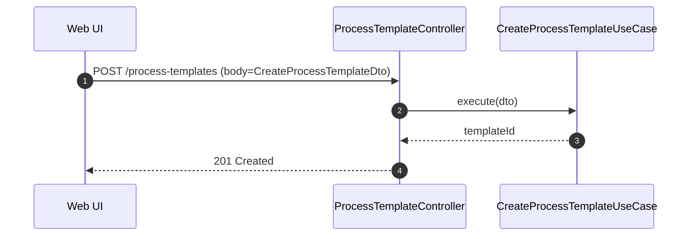

## AIエージェント チャット応答 OpenAI 切替 ― 詳細設計 v1.1 (Review Draft)

作成日: 2025-09-04
状態: v1.1 Review Draft

---

### 目的・前提
- 本設計は「要件（ai_agent_minimal_design_addendum.md）」を満たすための、実装に必要な定義情報を提示する。
- 設計の粒度: クラス/メソッド/インターフェイス/Enum/必要に応じたテーブル定義、シーケンス図。
- サンプルコードは含めない（定義系のみ）。

### スコープ（Phase 1）
- AIConversationService.processMessage を OpenAIService.generateResponse 経由に切替。
- PromptBuilder/HistoryAssembler/LLMOutputParser の導入。
- 返却DTOの互換性維持（aiResponse.content は人間可読、日本語）。
- 構造化JSON（ai_chat_process_template.v1）を応答末尾に添付（要件準拠）。
- usage.tokens の実値反映。cost は導入時期選択（未導入でも可）。

非スコープ
- テンプレ自動作成の実施（本Phaseは下準備まで）。

---

## 1. レイヤー別設計

### 1.1 Interfaces（Controller / WebSocket）
- 既存 AIAgentController のエンドポイントは維持。
  - POST /ai-agent/sessions/:sessionId/messages
  - 役割: 入力検証→UseCase呼出→レスポンス返却（構造化JSONは aiResponse.content 末尾のコードフェンス内に含まれる）
- SocketGateway: 変更なし。

### 1.2 Application（UseCases/Services）
- UseCase: ProcessUserMessageUseCase
  - 入力: { sessionId: string; userId: string; message: string }
  - 出力: { aiResponse: AIResponseDto; conversation: ConversationMessageDto[]; usage: UsageDto }
  - 呼出: PromptBuilder.buildSystemPrompt(context), HistoryAssembler.build(session, N), AIConversationService.processMessage(...), LLMOutputParser.extractTemplateJson(aiResponse.content)
  - 副作用: 会話保存、レート制限記録、モニタリング、（必要に応じて）構造化JSONの検証結果をログ。

- Service: PromptBuilder
  - 役割: System Prompt文字列の生成（要件に定義の方針）。
  - 入力: SessionContextDto（industry, processType, goal, region, compliance, additionalContext など）
  - 出力: string（system用プロンプト）

- Service: HistoryAssembler
  - 役割: 履歴 N 件の切り出しと OpenAI 形式メッセージ配列の生成。
  - 入力: InterviewSession + N
  - 出力: ChatMessage[]（systemは別途）

- Service: LLMOutputParser
  - 役割: aiResponse.content の末尾から ```json フェンス内の厳密JSONを抽出、スキーマ検証、Dtoへのマッピング補助。
  - 入力: aiResponse.content（string）
  - 出力: TemplateDraftParseResult（成功: AiChatProcessTemplateJson, 失敗: エラー情報）

- Mapper: TemplateDraftMapper
  - 役割: AiChatProcessTemplateJson → CreateProcessTemplateDto への変換。
  - 入力: AiChatProcessTemplateJson
  - 出力: CreateProcessTemplateDto

### 1.3 Domain
- Service: AIConversationService（既存の差し替え）
  - 役割: PromptBuilder/HistoryAssembler が作るメッセージを使って OpenAIService から応答を取得。
  - 入力: ProcessMessageInput
  - 出力: ProcessMessageOutput（content は日本語文章＋末尾にJSONフェンス）

- Entities: InterviewSession / ConversationMessage（既存）
  - 変更なし。

### 1.4 Infrastructure
- OpenAIService（既存）
  - generateResponse にて usage を必ず返却。rawText も返せるよう型定義を明確化。
- Monitoring/RateLimit（既存）
  - tokens 実値を記録。cost は0でも可。

### 1.5 Persistence（DB）
- Phase 1: テーブル変更なし。
  - 構造化JSONはレスポンスで返し、必要に応じてフロントまたは後続APIでテンプレ作成に利用。
- 将来案: ai_chat_outputs テーブル（監査や再処理用）
  - id, session_id, schema, json_payload(jsonb), created_at など（本Phaseは設計のみ言及）。

---

## 1.x 具体的設計決定（補強）

### A) dependsOn（seq→ID解決）

- 入力制約
  - seq は 1..N の連番（欠番/重複不可）
  - dependsOn は seq を参照し、将来参照（自分より大きい seq）禁止
- 正規化手順
  1. DTO を seq 昇順に検証
  2. Tx 開始、各ステップを挿入（depends_on_json は一旦 []）
  3. seq→id マップを確定
  4. 各ステップの dependsOn(seq[]) を id[] に変換して更新
  5. 循環検査（DAG）。不合格は rollback
- 例外/応答: 欠番/重複/将来参照/循環は 400（検証失敗）
- 監査: エラー分類を記録（本文保存なし）

### B) LLM 構造化JSON 抽出・検証

- 抽出優先: 「最後の」フェンス。言語ラベル json を最優先
- フェンスがない場合: 最後のコードブロックで先頭が { 末尾が } の場合のみ候補
- フェンスサイズ上限: 32KB
- 検証
  - 厳密 JSON（コメント/末尾カンマ不可）
  - schema === ai_chat_process_template.v1
  - stepTemplates: 必須フィールドと値域、seq 連番、seq=1 の basis は 'goal'
- エラー分類: MissingFence / NonJsonFence / JsonParseError / SchemaMismatch / ValidationFailed
- フォールバック: JSON が取り出せない場合でも会話応答は返す（JSON無し）
- 監査: schemaId とエラー分類のみ記録

### C) トークン予算と履歴トリミング

- 定数
  - responseMaxTokens = OPENAI_MAX_TOKENS（例: 1200）
  - safetyMarginTokens = 200
- 予算: contextBudget = modelContextLimit - (responseMaxTokens + safetyMarginTokens) - systemTokens
- 見積り: tokens≈ceil(utf8_bytes/4)
- 手順
  1. 最新から逆順に積み上げ、予算内になるまで採用
  2. 最低限、直近の user/assistant ペアは含める

### D) フォールバック仕様

- トリガ: Timeout/429/5xx/ネットワーク例外でリトライ枯渇
- 応答: content=固定日本語、usage.tokens=0、costUsd=0または未設定、JSON無し
- 監査: errorType, retryCount, duration（本文保存なし）

### E) 監査ハッシュ

- 正規化: role:content\n を連結、連続空白1つへ圧縮、先頭1000文字へ切詰め
- ハッシュ: SHA-256( AI_AUDIT_SALT + normalized )
- SALT 未設定: ハッシュ生成は無効化

### F) フィーチャーフラグ/DI 切替

- Token: AIConversationResponder
- 実装: MockResponder / OpenAIResponder
- Factory: 環境 AI_AGENT_MODE = 'mock'|'openai' でバインド

### G) 言語ポリシー（Phase1）

- 常に日本語。将来 languagePolicy を導入可能とする

---

## 2. インターフェイス/DTO/Enum 定義

> 注意: 以下は定義情報であり、実装は含みません。

### 2.1 OpenAI 連携

```ts
export interface ChatMessage {
  role: 'system' | 'user' | 'assistant';
  content: string;
}

export interface OpenAIResponseUsage {
  promptTokens?: number;
  completionTokens?: number;
  totalTokens?: number; // 必須
}

export interface OpenAIResponse {
  content: string; // アシスタントのテキスト（人間可読＋末尾にjsonフェンス）
  usage: OpenAIResponseUsage;
  raw?: unknown; // ベンダー固有情報（監視/デバッグ用）
}
```

### 2.2 Prompt/History

```ts
export interface SessionContextDto {
  industry?: string;
  processType?: string;
  goal?: string;
  region?: string;
  compliance?: string;
  additionalContext?: string;
}

export interface HistoryAssemblerOptions {
  windowSize: number; // 例: 12
  maxTokensBudget?: number; // 省略可
}
```

### 2.3 会話処理（UseCase↔Domain）

```ts
export interface ProcessMessageInput {
  sessionId: string;
  userId: string;
  message: string;
  context?: SessionContextDto;
  historyWindow?: number; // 例: 12
}

export interface ProcessMessageOutput {
  content: string; // 日本語の人間可読回答＋末尾にJSON
  usage: { tokens: number; costUsd?: number };
}
```

### 2.4 構造化JSON（要件準拠）

```ts
export enum AiChatSchemaId {
  ProcessTemplateV1 = 'ai_chat_process_template.v1',
}

export interface StepTemplateDraft {
  seq: number; // 1..N 連番
  name: string;
  basis: 'goal' | 'prev';
  offsetDays: number; // -365..365 の整数
  requiredArtifacts?: Array<{ kind: string; description?: string }>;
  dependsOn?: number[]; // seq 参照
}

export interface AiChatProcessTemplateJson {
  schema: AiChatSchemaId.ProcessTemplateV1;
  answer: string; // 日本語要約
  missing_information?: string[];
  process_template_draft?: {
    name?: string;
    stepTemplates: StepTemplateDraft[];
  };
}

export interface TemplateDraftParseResult {
  ok: boolean;
  schema?: AiChatSchemaId;
  data?: AiChatProcessTemplateJson;
  errors?: string[]; // 検証エラー一覧
}
```

### 2.5 CreateProcessTemplate 連携（既存DTOへの写像）

```ts
export interface CreateStepTemplateDto {
  seq: number;
  name: string;
  basis: 'goal' | 'prev';
  offsetDays: number;
  requiredArtifacts?: Array<{ kind: string; description?: string }>;
  dependsOn?: number[];
}

export interface CreateProcessTemplateDto {
  name: string;
  stepTemplates: CreateStepTemplateDto[];
}
```

### 2.6 エラー/例外

```ts
export enum AIConversationErrorCode {
  OpenAIUnavailable = 'OpenAIUnavailable',
  RateLimited = 'RateLimited',
  Timeout = 'Timeout',
  InvalidStructuredJson = 'InvalidStructuredJson',
}
```

---

## 3. クラス定義（概要）

### 3.1 PromptBuilder
- 責務: 要件文面に準拠した System Prompt を生成。
- メソッド
  - buildSystemPrompt(context: SessionContextDto): string

### 3.2 HistoryAssembler
- 責務: セッションから直近 N 件の履歴を抽出し、ChatMessage[] を生成。
- メソッド
  - build(sessionId: string, options: HistoryAssemblerOptions): Promise<ChatMessage[]> // user/assistantのみ

### 3.3 AIConversationService（差し替え）

- 責務: System + History + User を OpenAIService へ渡し、応答を受領。
- メソッド
  - processMessage(input: ProcessMessageInput): Promise<ProcessMessageOutput>
  - 内部で OpenAIService.generateResponse(messages, {model, temperature, maxTokens, retryPolicy}) を使用

### 3.4 LLMOutputParser

- 責務: aiResponse.content 末尾の JSON フェンスを抽出・検証。
- メソッド
  - extractTemplateJson(content: string): TemplateDraftParseResult

### 3.5 TemplateDraftMapper

- 責務: AiChatProcessTemplateJson → CreateProcessTemplateDto への写像（必要時）。
- メソッド
  - toCreateDto(json: AiChatProcessTemplateJson): CreateProcessTemplateDto

### 3.6 OpenAIService（型の明確化）

- メソッド
  - generateResponse(messages: ChatMessage[], options?: { model?: string; temperature?: number; maxTokens?: number }): Promise<OpenAIResponse>

---

## 4. 振る舞い/フロー（シーケンス図）

### 4.1 チャット応答生成（構造化JSON付）

```mermaid
sequenceDiagram
  autonumber
  participant UI as Web UI
  participant API as AIAgentController
  participant UC as ProcessUserMessageUseCase
  participant PB as PromptBuilder
  participant HA as HistoryAssembler
  participant SVC as AIConversationService
  participant OAI as OpenAIService
  participant PAR as LLMOutputParser

  UI->>API: POST /ai-agent/sessions/:id/messages
  API->>UC: execute(sessionId, userId, message)
  UC->>PB: buildSystemPrompt(context)
  PB-->>UC: systemPrompt
  UC->>HA: build(sessionId, {windowSize:N})
  HA-->>UC: ChatMessage[]
  UC->>SVC: processMessage({prompt, history, message})
  SVC->>OAI: generateResponse(messages, opts)
  OAI-->>SVC: OpenAIResponse(content + usage)
  SVC-->>UC: ProcessMessageOutput
  UC->>PAR: extractTemplateJson(content)
  PAR-->>UC: TemplateDraftParseResult(検証結果)
  UC-->>API: aiResponse + usage（JSONはcontent末尾）
  API-->>UI: 200 OK
```

### 4.2 テンプレ作成（将来・参照）



---

## 5. 設定・パラメータ（初期値）

- モデル: OPENAI_MODEL（現行の既定）
- temperature: 0.3
- maxTokens: 1200
- 履歴ウィンドウ N: 12
- リトライ: 最大1回（合計2試行）、バックオフ1.5s

---

## 6. 受け入れ条件（設計の充足判定）

- すべての定義（クラス/メソッド/インターフェイス/Enum）が本書に記載。
- 既存API契約を維持しつつ、aiResponse.content 末尾に厳密JSONを付与できる。
- LLMOutputParser がスキーマ検証可能で、CreateProcessTemplateDto への写像ルールが明確。
- DB 変更なしで Phase1 が実装可能。

---

## 7. オープン事項（要レビュー）

1) PromptBuilder の最終文面（addendumのsystem prompt）
2) Parserの厳格度（欠番/循環の扱い・警告で許容するか、エラーで拒否するか）
3) cost 実装の有効化タイミング
4) 監査ログの粒度（スキーマID/ハッシュのみ保存）
