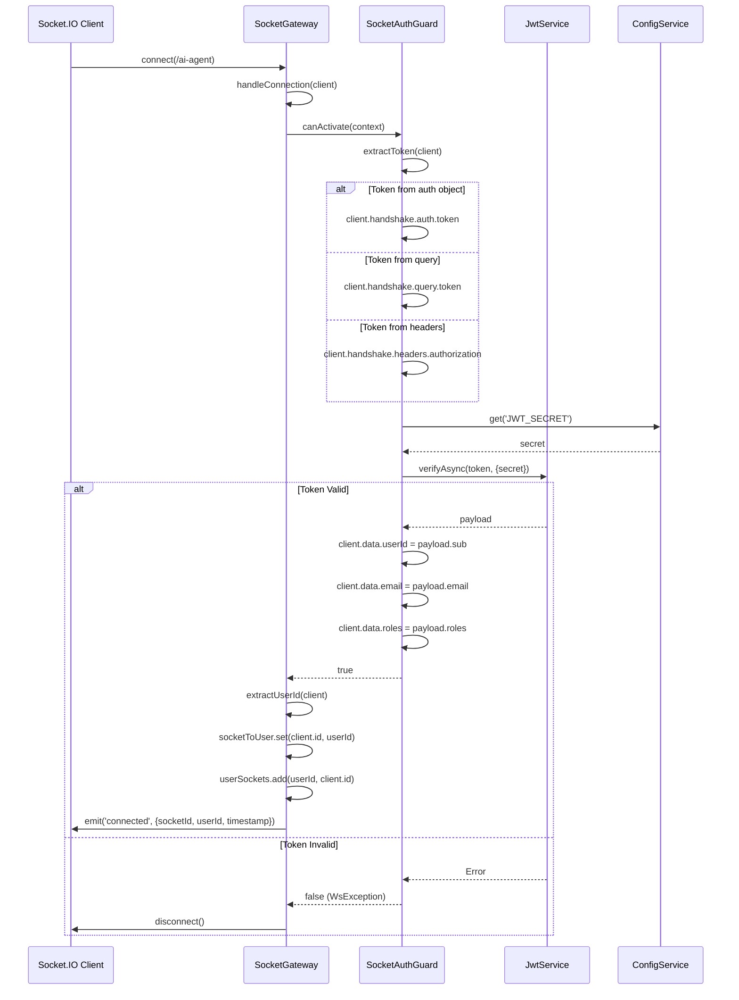
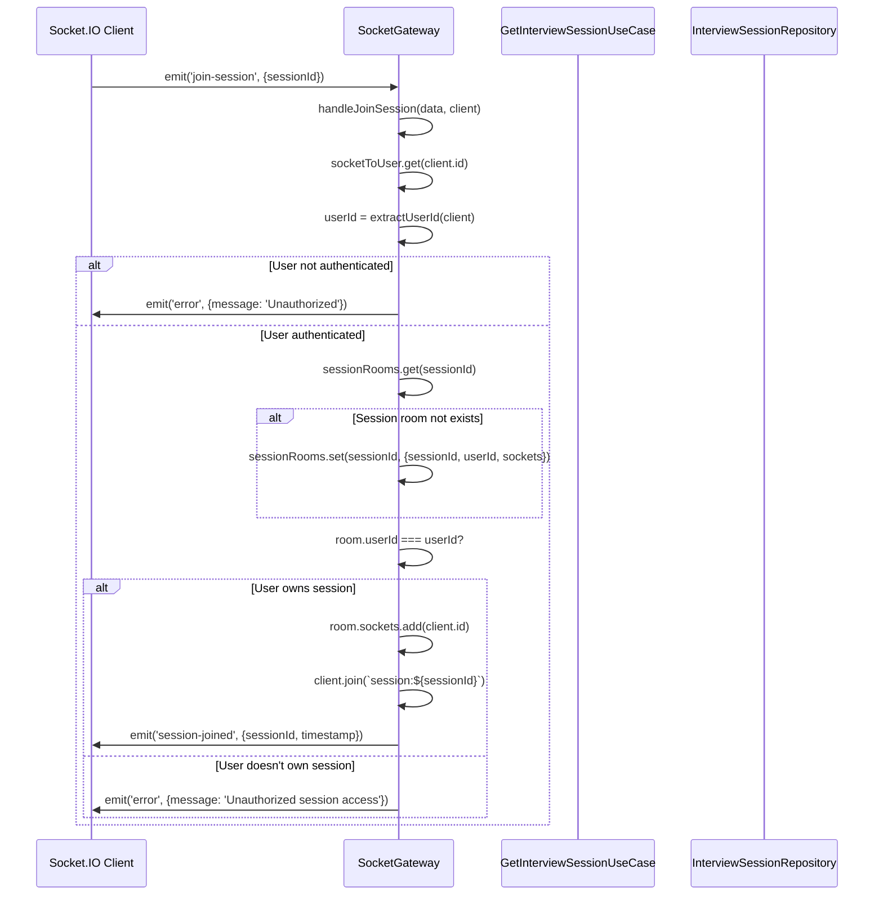
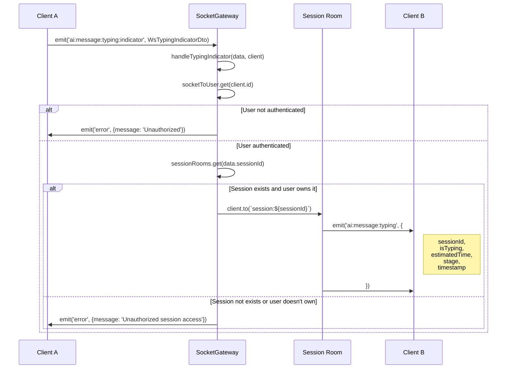
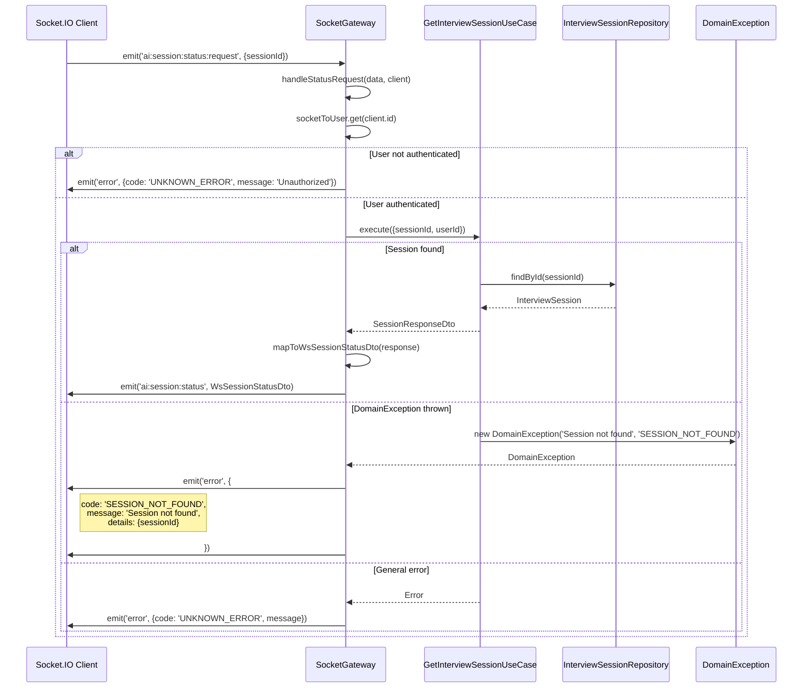
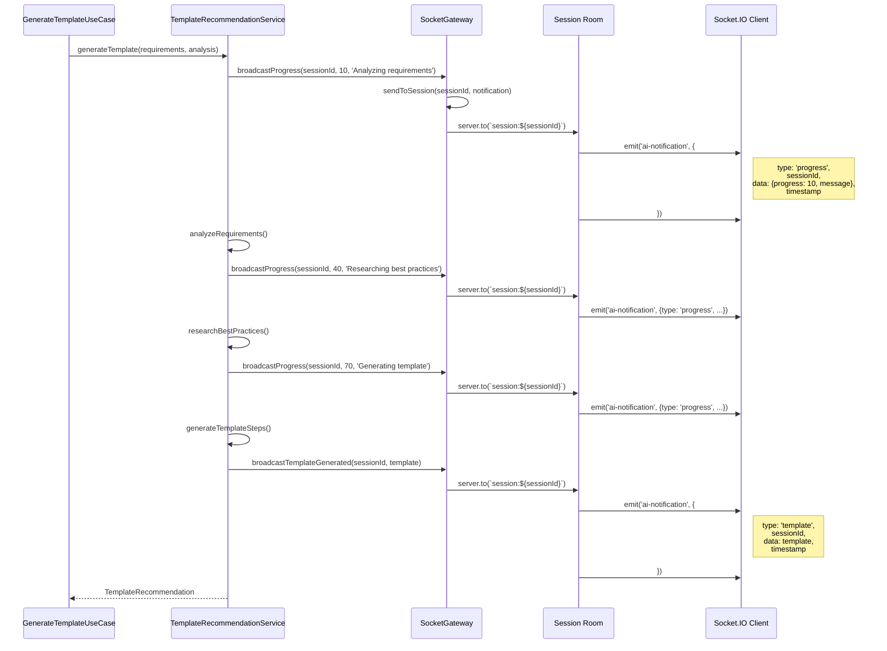

# AIエージェント機能 - シーケンス図設計書 v1.2

## 概要

本ドキュメントは、AIエージェント支援テンプレート作成機能の主要フローにおけるメソッド呼び出しシーケンスを詳細に定義します。
各オブジェクト間の相互作用、メソッド呼び出しのタイミング、データフローを明確化します。

## 関連ドキュメント

- [クラス図設計書](./ai_agent_class_diagram.md) - 全クラスのメソッド・プロパティ詳細
- [技術設計書](./ai_agent_technical_design.md) - 全体アーキテクチャ・API設計
- [Enum・型定義書](./ai_agent_enums_types.md) - 型安全性確保のための定義

## 主要シーケンス図

### 1. セッション開始フロー

### 2. メッセージ処理フロー

### 3. テンプレート生成フロー

### 4. Web検索フロー

### 5. エラーハンドリングフロー

## メソッド呼び出し詳細

### StartInterviewSessionUseCase.execute()
1. **validateInput()** - 入力データ検証
2. **checkRateLimit()** - レート制限チェック（AIRateLimitService使用）
3. **initializeSession()** - セッション初期化
4. **createSession()** - セッションエンティティ作成
5. **save()** - データベース保存
6. **cacheConversation()** - キャッシュ保存

※ AIRateLimitGuardはパススルー実装のため、実際のレート制限はUseCase層で実施

### ProcessUserMessageUseCase.execute()
1. **validateInput()** - 入力データ検証
2. **checkRateLimit()** - レート制限チェック（AIRateLimitService使用）
3. **findById()** - セッション取得
4. **processMessage()** - AI応答生成
5. **extractRequirements()** - 要件抽出
6. **updateSession()** - セッション更新
7. **updateConversation()** - 会話履歴更新
8. **logUsage()** - 利用統計記録

※ AIRateLimitGuardはパススルー実装のため、実際のレート制限はUseCase層で実施

### GenerateTemplateRecommendationsUseCase.execute()
1. **validateInput()** - 入力データ検証
2. **findById()** - セッション取得
3. **analyzeRequirements()** - 要件分析
4. **findBestPractices()** - 知識ベース検索
5. **performWebResearch()** - Web検索（非同期）
6. **generateRecommendations()** - テンプレート生成
7. **validateRecommendations()** - 推奨内容検証
8. **updateGeneratedTemplate()** - 生成結果保存

## 非同期処理フロー

### バックグラウンドジョブ処理

### 7. WebSocket接続・認証フロー

### 8. WebSocketセッション参加フロー

### 9. タイピングインジケーターフロー

### 10. セッションステータス要求フロー

### 11. AI処理進捗通知フロー

---

**本シーケンス図は実装チームが参照する詳細設計図です。次のステップでクラス図へのフィードバックを行い、設計の整合性を確保します。**
