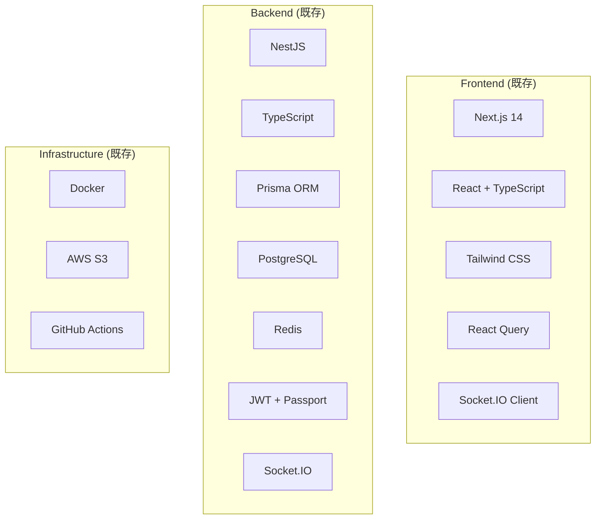
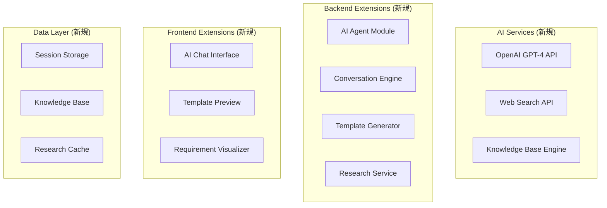
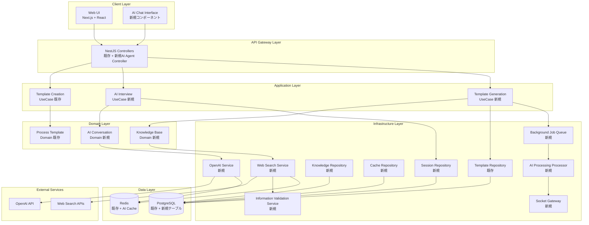
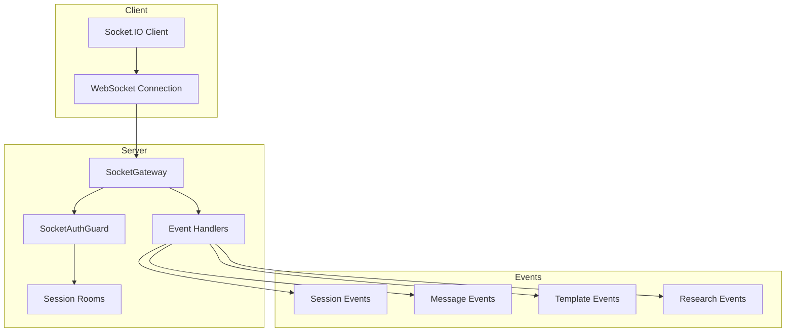

# AIエージェント支援テンプレート作成機能 - 技術設計書 v1.2

## 概要

本ドキュメントは、AIエージェント支援テンプレート作成機能の技術設計詳細を記述します。
システムアーキテクチャ、技術スタック、API設計、データモデル、セキュリティ実装について詳述します。

## 技術スタック

### 既存システム（継続利用）



### 新規追加技術スタック



## システムアーキテクチャ

### 全体アーキテクチャ



## 環境変数・設定管理

### 新規追加環境変数

```bash
# OpenAI API設定
OPENAI_API_KEY=sk-your-openai-api-key-here
OPENAI_MODEL=gpt-4-turbo-preview
OPENAI_MAX_TOKENS=4000
OPENAI_TEMPERATURE=0.7
OPENAI_TIMEOUT=30000

# AI機能制限設定
AI_RATE_LIMIT_MESSAGES_PER_MINUTE=10
AI_RATE_LIMIT_SESSIONS_PER_HOUR=5
AI_RATE_LIMIT_GENERATIONS_PER_DAY=20
AI_BUDGET_LIMIT_PER_USER_USD=100

# Web検索API設定
WEB_SEARCH_API_KEY=your-search-api-key
WEB_SEARCH_ENGINE=google
WEB_SEARCH_MAX_RESULTS=10
WEB_SEARCH_TIMEOUT=15000

# AI機能フラグ
AI_AGENT_ENABLED=true
AI_WEB_RESEARCH_ENABLED=true
AI_KNOWLEDGE_BASE_ENABLED=true

# データ保持設定
AI_CONVERSATION_RETENTION_DAYS=30
AI_RESEARCH_CACHE_TTL_HOURS=24
AI_SESSION_TIMEOUT_MINUTES=60

# セキュリティ設定
AI_DATA_ENCRYPTION_KEY=your-encryption-key
AI_ANONYMIZATION_ENABLED=true
AI_AUDIT_LOG_ENABLED=true
```

### 設定管理

**設定管理の詳細については、[AIエージェント機能 - クラス図設計書](./ai_agent_class_diagram.md) の `AIConfigService` クラス定義を参照してください。**

## API設計

### 新規エンドポイント

```typescript
// AIエージェントセッション管理
POST   /api/ai-agent/sessions                    // セッション開始
GET    /api/ai-agent/sessions/{sessionId}        // セッション取得
DELETE /api/ai-agent/sessions/{sessionId}        // セッション終了

// 対話・メッセージ
POST   /api/ai-agent/sessions/{sessionId}/messages  // メッセージ送信
GET    /api/ai-agent/sessions/{sessionId}/messages  // 会話履歴取得

// テンプレート生成
POST   /api/ai-agent/sessions/{sessionId}/generate-template  // テンプレート生成
POST   /api/ai-agent/sessions/{sessionId}/finalize-template  // テンプレート確定

// Web検索・リサーチ
GET    /api/ai-agent/research/best-practices     // ベストプラクティス検索
GET    /api/ai-agent/research/compliance         // コンプライアンス要件検索
GET    /api/ai-agent/research/benchmarks         // ベンチマーク情報検索

// 知識ベース管理
// Industry Templates (業界テンプレート)
GET    /api/ai-agent/knowledge/industries        // 業界テンプレート一覧取得
POST   /api/ai-agent/knowledge/industries        // 業界テンプレート作成
PUT    /api/ai-agent/knowledge/industries/:id    // 業界テンプレート更新
DELETE /api/ai-agent/knowledge/industries/:id    // 業界テンプレート削除

// Process Types (プロセス種別)
GET    /api/ai-agent/knowledge/process-types     // プロセス種別一覧取得
POST   /api/ai-agent/knowledge/process-types     // プロセス種別作成
PUT    /api/ai-agent/knowledge/process-types/:id // プロセス種別更新
DELETE /api/ai-agent/knowledge/process-types/:id // プロセス種別削除

// Best Practices (ベストプラクティス)
GET    /api/ai-agent/knowledge/best-practices    // ベストプラクティス一覧取得
POST   /api/ai-agent/knowledge/best-practices    // ベストプラクティス作成
PUT    /api/ai-agent/knowledge/best-practices/:id // ベストプラクティス更新
POST   /api/ai-agent/knowledge/best-practices/bulk-update // ベストプラクティス一括更新

// Feedback
POST   /api/ai-agent/knowledge/feedback          // フィードバック送信
```

### エンドポイント → 実装クラス群マッピング

| エンドポイント | Controller | UseCase | Domain Service | Repository/External |
|---------------|------------|---------|----------------|-------------------|
| `POST /api/ai-agent/sessions` | AIAgentController.startSession | StartInterviewSessionUseCase | AIConversationService | InterviewSessionRepository |
| `GET /api/ai-agent/sessions/{id}` | AIAgentController.getSession | GetInterviewSessionUseCase | - | InterviewSessionRepository |
| `DELETE /api/ai-agent/sessions/{id}` | AIAgentController.endSession | EndInterviewSessionUseCase | - | InterviewSessionRepository |
| `POST /api/ai-agent/sessions/{id}/messages` | AIAgentController.sendMessage | ProcessUserMessageUseCase | AIConversationService<br/>ProcessAnalysisService | InterviewSessionRepository<br/>OpenAIService |
| `GET /api/ai-agent/sessions/{id}/messages` | AIAgentController.getMessages | GetConversationHistoryUseCase | - | InterviewSessionRepository |
| `POST /api/ai-agent/sessions/{id}/generate-template` | AIAgentController.generateTemplate | GenerateTemplateRecommendationsUseCase | TemplateRecommendationService<br/>ProcessAnalysisService | InterviewSessionRepository<br/>ProcessKnowledgeRepository<br/>OpenAIService |
| `POST /api/ai-agent/sessions/{id}/finalize-template` | AIAgentController.finalizeTemplate | FinalizeTemplateCreationUseCase | TemplateRecommendationService | InterviewSessionRepository<br/>ProcessTemplateRepository<br/>TemplateGenerationHistoryRepository |
| `GET /api/ai-agent/research/best-practices` | AIAgentController.searchBestPractices | SearchBestPracticesUseCase | WebResearchService | WebResearchCacheRepository<br/>WebSearchService |
| `GET /api/ai-agent/research/compliance` | AIAgentController.searchCompliance | SearchComplianceRequirementsUseCase | WebResearchService | WebResearchCacheRepository<br/>WebSearchService |
| `GET /api/ai-agent/research/benchmarks` | AIAgentController.searchBenchmarks | SearchProcessBenchmarksUseCase | WebResearchService | WebResearchCacheRepository<br/>WebSearchService |
| `GET /api/ai-agent/knowledge/industries` | AIAgentController.getIndustries | GetIndustryTemplatesUseCase | KnowledgeBaseManagerService | ProcessKnowledgeRepository |
| `POST /api/ai-agent/knowledge/industries` | AIAgentController.createIndustryTemplate | CreateIndustryTemplateUseCase | KnowledgeBaseManagerService | ProcessKnowledgeRepository |
| `PUT /api/ai-agent/knowledge/industries/:id` | AIAgentController.updateIndustryTemplate | UpdateIndustryTemplateUseCase | KnowledgeBaseManagerService | ProcessKnowledgeRepository |
| `DELETE /api/ai-agent/knowledge/industries/:id` | AIAgentController.deleteIndustryTemplate | DeleteIndustryTemplateUseCase | KnowledgeBaseManagerService | ProcessKnowledgeRepository |
| `GET /api/ai-agent/knowledge/process-types` | AIAgentController.getProcessTypes | GetProcessTypesUseCase | KnowledgeBaseManagerService | ProcessKnowledgeRepository |
| `POST /api/ai-agent/knowledge/process-types` | AIAgentController.createProcessType | CreateProcessTypeUseCase | KnowledgeBaseManagerService | ProcessKnowledgeRepository |
| `PUT /api/ai-agent/knowledge/process-types/:id` | AIAgentController.updateProcessType | UpdateProcessTypeUseCase | KnowledgeBaseManagerService | ProcessKnowledgeRepository |
| `DELETE /api/ai-agent/knowledge/process-types/:id` | AIAgentController.deleteProcessType | DeleteProcessTypeUseCase | KnowledgeBaseManagerService | ProcessKnowledgeRepository |
| `GET /api/ai-agent/knowledge/best-practices` | AIAgentController.getBestPractices | GetBestPracticesUseCase | KnowledgeBaseManagerService | ProcessKnowledgeRepository |
| `POST /api/ai-agent/knowledge/best-practices` | AIAgentController.createBestPractice | CreateBestPracticeUseCase | KnowledgeBaseManagerService | ProcessKnowledgeRepository |
| `PUT /api/ai-agent/knowledge/best-practices/:id` | AIAgentController.updateBestPractice | UpdateBestPracticeUseCase | KnowledgeBaseManagerService | ProcessKnowledgeRepository |
| `POST /api/ai-agent/knowledge/best-practices/bulk-update` | AIAgentController.bulkUpdateBestPractices | BulkUpdateBestPracticesUseCase | KnowledgeBaseManagerService | ProcessKnowledgeRepository |
| `POST /api/ai-agent/knowledge/feedback` | AIAgentController.submitFeedback | CollectUserFeedbackUseCase | - | TemplateGenerationHistoryRepository |

### データフロー詳細

#### セッション開始フロー
```
POST /api/ai-agent/sessions
↓
AIAgentController.startSession()
↓
StartInterviewSessionUseCase.execute()
↓
AIConversationService.initializeSession()
↓
InterviewSessionRepository.save()
```

#### メッセージ処理フロー
```
POST /api/ai-agent/sessions/{id}/messages
↓
AIAgentController.sendMessage()
↓
ProcessUserMessageUseCase.execute()
├─ AIConversationService.processMessage()
│  └─ OpenAIService.generateResponse()
├─ ProcessAnalysisService.extractRequirements()
└─ InterviewSessionRepository.updateConversation()
```

#### テンプレート生成フロー
```
POST /api/ai-agent/sessions/{id}/generate-template
↓
AIAgentController.generateTemplate()
↓
GenerateTemplateRecommendationsUseCase.execute()
├─ ProcessAnalysisService.analyzeRequirements()
├─ TemplateRecommendationService.generateRecommendations()
│  ├─ ProcessKnowledgeRepository.findBestPractices()
│  └─ OpenAIService.generateTemplate()
└─ InterviewSessionRepository.updateGeneratedTemplate()
```

### 実装詳細参照

**詳細な実装設計については、以下のドキュメントを参照してください：**
- [AIエージェント機能 - クラス図設計書](./ai_agent_class_diagram.md) - 全クラスのメソッド・プロパティ詳細
- [AIエージェント機能 - シーケンス図設計書](./ai_agent_sequence_diagram.md) - メソッド呼び出しフロー詳細
- [AIエージェント機能 - Enum・型定義書](./ai_agent_enums_types.md) - 型安全性確保のための定義

## データモデル設計

**詳細なデータベース設計については、[AIエージェント機能 - データベース設計書](./ai_agent_database_design.md) を参照してください。**

### 主要テーブル概要
- `ai_interview_sessions` - AIエージェントとのインタビューセッション管理
- `ai_background_jobs` - バックグラウンドジョブ管理
- `ai_process_knowledge` - プロセス知識ベース
- `ai_web_research_cache` - Web検索結果キャッシュ
- `ai_template_generation_history` - テンプレート生成履歴・フィードバック
- `ai_usage_statistics` - AI機能利用統計

## セキュリティ・プライバシー実装

### データ暗号化

```typescript
@Injectable()
export class DataEncryptionService {
  private readonly algorithm = 'aes-256-gcm';
  private readonly keyLength = 32;
  private readonly ivLength = 16;
  private readonly tagLength = 16;

  constructor(private configService: ConfigService) {}

  private getEncryptionKey(): Buffer {
    const key = this.configService.get<string>('AI_DATA_ENCRYPTION_KEY');
    return crypto.scryptSync(key, 'salt', this.keyLength);
  }

  encrypt(data: string): string {
    const key = this.getEncryptionKey();
    const iv = crypto.randomBytes(this.ivLength);
    const cipher = crypto.createCipher(this.algorithm, key, iv);
    
    let encrypted = cipher.update(data, 'utf8', 'hex');
    encrypted += cipher.final('hex');
    
    const tag = cipher.getAuthTag();
    
    return iv.toString('hex') + ':' + tag.toString('hex') + ':' + encrypted;
  }

  decrypt(encryptedData: string): string {
    const [ivHex, tagHex, encrypted] = encryptedData.split(':');
    const key = this.getEncryptionKey();
    const iv = Buffer.from(ivHex, 'hex');
    const tag = Buffer.from(tagHex, 'hex');
    
    const decipher = crypto.createDecipher(this.algorithm, key, iv);
    decipher.setAuthTag(tag);
    
    let decrypted = decipher.update(encrypted, 'hex', 'utf8');
    decrypted += decipher.final('utf8');
    
    return decrypted;
  }
}
```

### レート制限実装

```typescript
@Injectable()
export class AIRateLimitService {
  constructor(
    private redis: Redis,
    private configService: AIConfigService,
  ) {}

  async checkRateLimit(userId: number, action: string): Promise<void> {
    const limits = this.configService.rateLimits;
    const key = `rate_limit:${userId}:${action}`;
    
    const current = await this.redis.get(key);
    const limit = this.getLimitForAction(action, limits);
    
    if (current && parseInt(current) >= limit.max) {
      throw new TooManyRequestsException(
        `Rate limit exceeded for ${action}. Max ${limit.max} per ${limit.window}`,
      );
    }
    
    await this.redis.incr(key);
    await this.redis.expire(key, limit.window);
  }

  private getLimitForAction(action: string, limits: any) {
    const actionLimits = {
      'send_message': { max: limits.messagesPerMinute, window: 60 },
      'start_session': { max: limits.sessionsPerHour, window: 3600 },
      'generate_template': { max: limits.generationsPerDay, window: 86400 },
    };
    
    return actionLimits[action] || { max: 10, window: 60 };
  }
}
```

## パフォーマンス最適化

### キャッシュ戦略

```typescript
@Injectable()
export class AICacheService {
  constructor(private redis: Redis) {}

  // 会話履歴キャッシュ
  async cacheConversation(sessionId: string, conversation: any[]): Promise<void> {
    const key = `conversation:${sessionId}`;
    await this.redis.setex(key, 3600, JSON.stringify(conversation)); // 1時間
  }

  // 検索結果キャッシュ
  async cacheSearchResults(queryHash: string, results: any[]): Promise<void> {
    const key = `search:${queryHash}`;
    await this.redis.setex(key, 86400, JSON.stringify(results)); // 24時間
  }

  // テンプレート推奨キャッシュ
  async cacheTemplateRecommendation(requirementsHash: string, template: any): Promise<void> {
    const key = `template:${requirementsHash}`;
    await this.redis.setex(key, 7200, JSON.stringify(template)); // 2時間
  }
}
```

### 非同期処理

```typescript
@Processor('ai-processing')
export class AIProcessingProcessor {
  @Process('web-research')
  async handleWebResearch(job: Job<WebResearchJobData>) {
    const { sessionId, query, industry } = job.data;
    
    try {
      const results = await this.webSearchService.searchBestPractices(industry, query);
      await this.sessionRepository.updateResearchResults(sessionId, results);
      
      // WebSocket通知
      this.socketGateway.notifyResearchComplete(sessionId, results);
    } catch (error) {
      this.logger.error('Web research failed', error);
      throw error;
    }
  }

  @Process('template-generation')
  async handleTemplateGeneration(job: Job<TemplateGenerationJobData>) {
    const { sessionId, requirements } = job.data;
    
    try {
      const template = await this.aiService.generateTemplate(requirements);
      await this.sessionRepository.updateGeneratedTemplate(sessionId, template);
      
      // WebSocket通知
      this.socketGateway.notifyTemplateGenerated(sessionId, template);
    } catch (error) {
      this.logger.error('Template generation failed', error);
      throw error;
    }
  }
}
```

## 監視・ログ

### AI利用監視

```typescript
@Injectable()
export class AIMonitoringService {
  constructor(
    private logger: Logger,
    private metricsService: MetricsService,
  ) {}

  logAIRequest(userId: number, action: string, tokens: number, cost: number): void {
    this.logger.info('AI request', {
      userId,
      action,
      tokens,
      cost,
      timestamp: new Date().toISOString(),
    });

    // メトリクス記録
    this.metricsService.incrementCounter('ai_requests_total', { action });
    this.metricsService.recordHistogram('ai_tokens_used', tokens, { action });
    this.metricsService.recordHistogram('ai_cost_usd', cost, { action });
  }

  logAIError(userId: number, action: string, error: Error): void {
    this.logger.error('AI request failed', {
      userId,
      action,
      error: error.message,
      stack: error.stack,
      timestamp: new Date().toISOString(),
    });

    this.metricsService.incrementCounter('ai_errors_total', { action, error: error.name });
  }
}
```

## WebSocket/リアルタイム通信設計

### WebSocket通信アーキテクチャ



### WebSocket名前空間

```typescript
// AI Agent専用名前空間
namespace: '/ai-agent'
```

### イベント構造

#### クライアント → サーバー

| イベント名 | 説明 | ペイロード |
|-----------|------|-----------|
| join-session | セッションルームへの参加 | `{sessionId: string}` |
| leave-session | セッションルームからの離脱 | `{sessionId: string}` |
| ai:message:typing:indicator | タイピングインジケーター送信 | `WsTypingIndicatorDto` |
| ai:session:status:request | セッションステータス要求 | `WsRequestSessionStatusDto` |

#### サーバー → クライアント

| イベント名 | 説明 | ペイロード |
|-----------|------|-----------|
| connected | 接続確認 | `{socketId: string, userId: number, timestamp: Date}` |
| session-joined | セッション参加確認 | `{sessionId: string, timestamp: Date}` |
| session-left | セッション離脱確認 | `{sessionId: string, timestamp: Date}` |
| ai:session:status | セッションステータス変更 | `WsSessionStatusDto` |
| ai:message:typing | タイピング状態通知 | `WsTypingIndicatorDto` |
| ai:message:received | AIメッセージ受信 | `WsMessageNotificationDto` |
| ai:template:progress | テンプレート生成進捗 | `WsTemplateProgressDto` |
| ai:template:completed | テンプレート生成完了 | `WsTemplateCompletedDto` |
| ai:research:progress | リサーチ進捗 | `WsResearchProgressDto` |
| ai-notification | 汎用通知 | `AINotification` |
| error | エラー通知 | `WsErrorNotificationDto` |

### 認証・認可

#### JWT認証フロー

```typescript
// 1. ハンドシェイク時の認証
client.handshake.auth.token // 優先度1
client.handshake.query.token // 優先度2
client.handshake.headers.authorization // 優先度3 (Bearer token)

// 2. トークン検証
jwtService.verifyAsync(token, { secret: JWT_SECRET })

// 3. ユーザー情報の格納
client.data.userId = payload.sub
client.data.email = payload.email
client.data.roles = payload.roles
```

### セッション管理

#### セッションルーム構造

```typescript
interface AISessionRoom {
  sessionId: string      // セッションID
  userId: number        // セッション所有者
  sockets: Set<string>  // 接続中のソケットID群
}
```

#### 内部データ構造

```typescript
// セッションルーム管理
sessionRooms: Map<string, AISessionRoom>

// ユーザー別ソケット管理
userSockets: Map<number, Set<string>>

// ソケット→ユーザーマッピング
socketToUser: Map<string, number>
```

### エラーハンドリング

#### WebSocketエラー種別

| エラータイプ | コード | 説明 | リトライ可能 |
|-------------|--------|------|-------------|
| 認証エラー | UNAUTHORIZED | トークン無効・期限切れ | No |
| セッションエラー | SESSION_NOT_FOUND | セッション不存在 | No |
| アクセスエラー | UNAUTHORIZED_ACCESS | セッション所有権なし | No |
| 通信エラー | NETWORK_ERROR | ネットワーク障害 | Yes |
| サーバーエラー | UNKNOWN_ERROR | 予期しないエラー | Yes |

### パフォーマンス最適化

#### 接続管理

- **ハートビート**: 30秒間隔（Socket.IO標準）
- **再接続**: 自動再接続（最大5回、指数バックオフ）
- **タイムアウト**: 60秒（セッションタイムアウトと同期）

#### イベント配信最適化

- **ルームベース配信**: セッション単位でのイベント配信
- **ユーザーベース配信**: 複数デバイス対応
- **選択的配信**: 必要なクライアントのみへの配信

### セキュリティ対策

#### 接続セキュリティ

- **CORS設定**: フロントエンドURLのみ許可
- **認証必須**: SocketAuthGuardによる全接続の認証
- **セッション検証**: 所有権確認による不正アクセス防止

#### データ保護

- **ペイロード検証**: DTOによる入力検証
- **サイズ制限**: メッセージサイズ上限設定
- **レート制限**: 接続数・メッセージ数制限（将来実装）

## バリデーション戦略

### レイヤー別責務

1. **DTOレベル（既存）**
   - 型検証（@IsString, @IsNumber など）
   - 必須項目チェック（@IsNotEmpty）
   - 文字列長制限（@MaxLength）
   - 数値範囲検証（@Min, @Max）

2. **Validatorレベル（新規・最小実装）**
   - ビジネスルール検証
   - システム制限値チェック（VALIDATION_CONSTANTS使用）
   - 複合条件検証（将来実装）

### 実装方針

- **最小限実装**: `ai_agent_enums_types.md`の定数を使用した制限値チェックのみ
- **拡張性確保**: BaseValidatorクラスにより将来の拡張に対応
- **保守性重視**: DTOとの重複を避け、明確な責務分離

### Validator実装詳細

| Validator | 検証内容 | 使用定数 |
|-----------|---------|---------|
| ai-session.validator.ts | アクティブセッション数制限 | maxConcurrentSessions (AIConfigService) |
| ai-message.validator.ts | セッション内要件数上限 | MAX_REQUIREMENTS_PER_SESSION |
| ai-template.validator.ts | テンプレート内ステップ数上限、信頼度スコア下限 | MAX_STEPS_PER_TEMPLATE, MIN_CONFIDENCE_SCORE |

## 関連ドキュメント

- **[ai_agent_template_creation_improvement.md](ai_agent_template_creation_improvement.md)** - 概要・要件定義
- **[ai_agent_implementation_plan.md](ai_agent_implementation_plan.md)** - 実装計画・タスク詳細

---

**本技術設計書は実装チームが参照する詳細仕様書です。実装前に必ずレビューを実施してください。**
